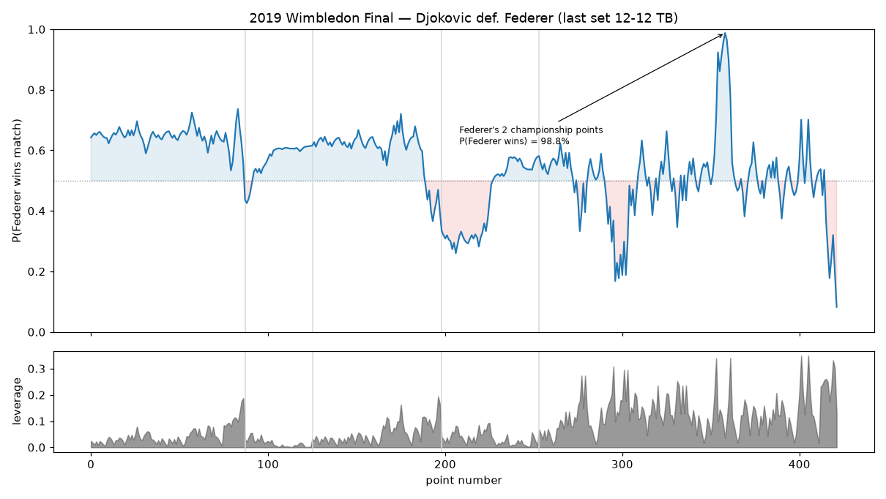

# Match win-probability — the score-tree layer

The point eval (`chess_point_analysis`) answers *"how is this rally going?"* — P(server
wins **the point**) from the rally state. This experiment builds the layer *on top* of it
that answers *"how is the match going?"* — P(a player wins **the match**) from the score —
and the **leverage** of each point (how much it can swing the match). It does **not**
replace the point eval; it consumes it.

## Why an analytic model is the right tool here

The `score_aware_eval` experiment showed that conditioning the point eval on the score
does **not** improve it — points are ~independent given the server (the Klaassen–Magnus
result). That negative result is exactly the assumption that makes an *analytic* score
tree exact: if each player wins points on serve at a fixed rate, win probability
propagates point → game → set → match in closed form. So instead of fitting another
empirical table, we propagate two numbers up the scoring tree.

## Inputs: matchup strength + leverage

- **Matchup strength** is the only free parameter: `p1`, `p2` = each player's probability
  of winning a point on their own serve *against this opponent*. Built from both a player's
  **serve** rate and the opponent's **return** rate, combined additively around the league
  mean (`serve_A − return_B + (1 − μ)`), so an elite returner correctly drags the server's
  number down — the model credits returning, not just serving. `μ` is just the league
  serve-win rate (a plain count — the same quantity the point eval's `base()` converges to).
- **No leakage.** The rates are estimated **walk-forward**: a match is scored only from
  matches played *strictly earlier*, so neither the match itself nor any later match leaks
  into its own prediction. That is what lets the calibration below count as genuinely
  predictive rather than circular. The honest cost: a player with little prior charted
  history shrinks toward the league mean (an even matchup), so early/sparse matches are
  less sharply discriminated.
- **Leverage closes the loop back to shot quality.** The point eval scores each shot's WPA
  in *point*-win units; multiplying by a point's leverage re-expresses it in *match*-win
  units. A blunder on a swing point costs far more than the same shot at 40-0 — shot
  quality, finally priced in the units that decide the match.

The score tree itself is a classical tennis model, not a chess one — chess has no nested
scoring to propagate through. Its only input is the pre-point scalar `p1/p2`, which is
pluggable: a flat league constant, the serve+return rates used here, the point eval's
`base()`, or a future strength model all slot into the same `MatchWP(p1, p2, …)`. The
chess crossover is the one layer on top, leverage-weighted shot quality.

## The model (`winprob_match.py`)

`MatchWP(p1, p2, best_of)` with memoized recursions / closed forms over standard scoring:

- **game** — closed form, with the deuce geometric series `g²/(g²+(1−g)²)`.
- **tiebreak** — recursion tracking the 1-2-2 serve rotation, with a tiebreak-deuce closed
  form (same algebra, serve split one each over the two deuce points).
- **set** — recursion over games using each player's hold probability; 7-point tiebreak at
  6-6 (overridable — the 2019 Wimbledon final's 12-12 breaker renders exactly).
- **match** — best-of-3 or -5 over sets.

`wp(score)` gives the live number at any point; `leverage(score)` = `wp(win the point) −
wp(lose the point)`. Two documented approximations, each worth <0.1% WP: the first server
of a new set is taken as the alternation of the previous set's, and non-standard historical
final-set rules default to the 6-6 tiebreak.

## Validation (three independent ways)

1. **Internally exact** — satisfies the martingale identity `WP = P(win pt)·WP(after win) +
   P(lose pt)·WP(after lose)` to **~2e-16** over 40k random states (best-of-3 and -5).
2. **Calibrated against real outcomes** — model WP at every point vs the eventual winner
   tracks the diagonal across all deciles (men log-loss 0.532, women 0.544 — both far below
   the 0.693 of a coin-flip). Because strength is estimated walk-forward, this is a *genuine*
   out-of-sample test, not a circular one. The slight under-confidence at the extremes is the
   safe direction — shrinkage toward an even matchup for players with thin prior charting.
3. **Face-valid on a marquee match** — the 2019 Wimbledon final curve below.

## What it finds



Federer's win probability peaks at **98.8%** serving at 8-7, 40-15 in the fifth — two
championship points — then collapses as Djokovic saves them and takes the decider. (His
peak is a touch under 99% precisely because the model credits Djokovic's elite return, so
even serving for the title Federer's hold isn't a formality.)

A subtle, correct result falls out of the leverage panel: **the championship points are
*low* leverage** (Federer was already ~99% — the match barely swings on them), while the
highest-leverage points are the *tight* fifth-set break points where the match is genuinely
in the balance. Leverage measures pivotality, not drama. Scaling the point eval's shot-WPA
by leverage then ranks the match's biggest match-WP swings (the "clutch blunders").

```bash
uv run python experiments/match_winprob/run.py
```

Writes `reports/match_winprob.md`, `reports/figures/match_winprob_calibration.png`, and
`reports/figures/match_winprob_curve.png`.

## Limitations

- **Strength is serve+return only** — walk-forward and matchup-aware, but with no surface,
  form, fatigue, or recency weighting, and thin-history players collapse toward an even
  matchup. A real forecaster would model `p1`, `p2` with those covariates.
- **iid points** — the assumption is a *good* approximation (per `score_aware_eval`), not
  exact; it is part of why the out-of-sample calibration isn't perfect.
- **Charting bias** — same coverage caveat as the rest of the repo; and the leverage-weighted
  shot quality inherits the point eval's conflation of selection, execution, and pressure.

## Richer matchup strength

Anything better than serve+return improves the `p1/p2` input and plugs in behind the same
scalar seam, leaving the tree and the leverage layer unchanged. Two candidates were tried
and came back negative: surface-specific rates (`../surface_winprob`) and recency/form
weighting (`../form_streakiness`). Opponent-adjusted ratings, external covariates
(ranking, fatigue, conditions) and a learned strength model are untried.
