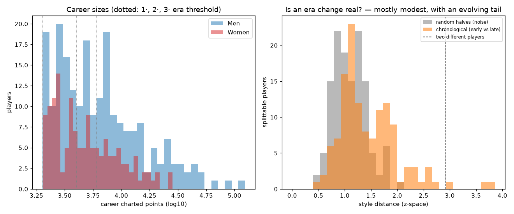

# Career splitting — does it capture real change?

*Generated by `experiments/career_splits/run.py`. The justification for the optional **`player_eras`** table (build it with `match-charting-project eras`). Distances are in standardized style space (10 features); the split decision is deterministic (each player's noise estimate is seeded from their name).*

## Men

- **Tracked players (≥2000 pts):** 215; long-career candidates (≥4000 pts, ≥8-yr span, ≥4 charted yrs): 102.
- **Is the change real?** median early-vs-late gap = 1.23, a median **1.37×** the random-split noise of the same data; **26** (31%) clear the 1.5× bar and are split.
- Two *different* players sit 2.95 apart, so a typical era gap is 42% of a whole different player.

Most-evolved long careers (early→late, biggest feature shifts):
- **Tim Henman** (1995–2006, gap 3.85): serve_wide +1.8σ, serve_t −1.7σ, slice_pct +1.6σ
- **Benoit Paire** (2012–2022, gap 3.61): df_rate +3.2σ, gs_winner_rate −1.1σ, serve_wide +0.7σ
- **Michael Chang** (1989–1998, gap 2.98): serve_t +1.9σ, avg_rally_len −1.3σ, ace_rate +1.2σ
- **Jimmy Connors** (1974–1991, gap 2.78): avg_rally_len +1.5σ, unforced_rate +1.5σ, gs_winner_rate −1.1σ
- **Jaume Munar** (2018–2026, gap 2.56): serve_t +1.9σ, serve_wide −1.5σ, ace_rate +0.6σ
- **Marcos Baghdatis** (2004–2019, gap 2.56): gs_winner_rate −1.7σ, serve_t −1.4σ, serve_wide +1.0σ

## Women

- **Tracked players (≥2000 pts):** 143; long-career candidates (≥4000 pts, ≥8-yr span, ≥4 charted yrs): 59.
- **Is the change real?** median early-vs-late gap = 1.46, a median **1.20×** the random-split noise of the same data; **8** (18%) clear the 1.5× bar and are split.
- Two *different* players sit 2.90 apart, so a typical era gap is 50% of a whole different player.

Most-evolved long careers (early→late, biggest feature shifts):
- **Monica Seles** (1990–2003, gap 2.63): fh_share −1.6σ, avg_rally_len −1.3σ, gs_winner_rate −1.1σ
- **Kim Clijsters** (2001–2021, gap 2.36): serve_wide −1.8σ, df_rate +1.2σ, fh_share −0.6σ
- **Sloane Stephens** (2013–2026, gap 1.97): serve_wide +1.2σ, serve_t −1.0σ, unforced_rate −0.7σ
- **Aryna Sabalenka** (2016–2026, gap 1.96): df_rate −1.3σ, unforced_rate −0.7σ, serve_t −0.6σ
- **Jelena Ostapenko** (2014–2026, gap 1.89): unforced_rate −1.0σ, avg_rally_len −1.0σ, fh_share −0.8σ
- **Marie Bouzkova** (2018–2026, gap 1.88): gs_winner_rate −1.5σ, unforced_rate −0.6σ, net_pct +0.6σ

## Threshold sensitivity

How many careers split (and total entities, from 358 tracked) as the noise-ratio cutoff varies — the 1.5–2.0 band is crowded, and a uniform 2.0 erases the women (their sparser charting raises the noise floor):

| cutoff | split (M / W) | entities |
|---|---|---|
| >1.25 | 53 / 19 | 430 |
| >1.5  ← used | 26 / 8 | 392 |
| >1.75 | 14 / 2 | 374 |
| >2.0 | 6 / 0 | 364 |
| >2.5 | 1 / 0 | 359 |

## Verdict: split selectively, not across the board

Even among long careers, the median early-vs-late style gap is only **1.29×** the random-split noise — most players are stylistically *stable*, so a blanket split would dilute data. But a real minority — **34 players** — evolve clearly (>1.5× noise), with face-valid detections (Sabalenka's serve-yips fix, Paire's decline, Chang adding serve). Those are split binary early/late — the only contrast this test validated — and materialized into the **`player_eras`** table (everyone else stays whole), ready for the clustering / WPA / win-prob experiments and the web frontend to join to.
