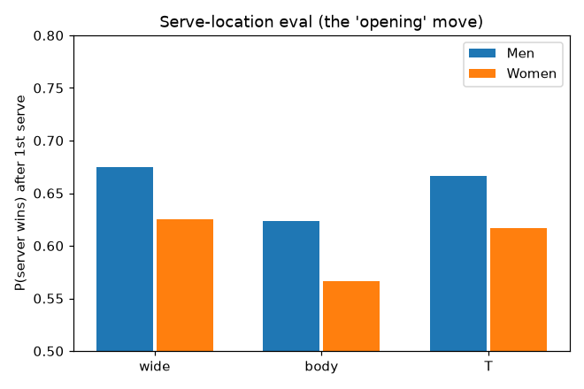
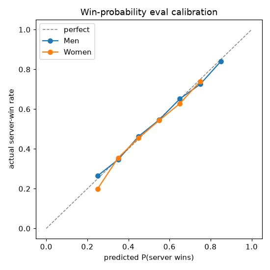
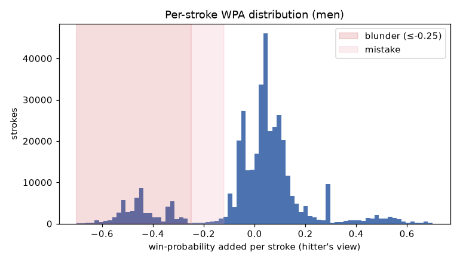

# Chess-style point analysis: win-probability & shot quality

*Generated by `experiments/chess_point_analysis/run.py`. Treats each point's shot notation as a move list, builds an empirical P(server wins) eval, and scores every stroke by win-probability added (WPA) — the centipawn-loss / blunder idea ported to tennis.*

## Serve as the opening move
- Men, P(server wins) after a 1st serve: wide **67.5%**, body **62.3%**, T **66.6%**
- Women, P(server wins) after a 1st serve: wide **62.5%**, body **56.6%**, T **61.6%**



## Richer state: the optional details now in the eval

Shot direction was always used; the rally state now also reads **return depth** (7/8/9), **slice vs drive**, and **net/approach** (+/- modifiers). Raw men's server-win% by each detail (marginal, so confounded — but the signal is clearly present):

- **Return depth** — deep(9) 46.9% · mid(8) 52.4% · shallow(7) 57.8%  (a deeper return weakens the serve hold)
- **Return type** — drive 60.1% vs slice 70.7%
- **Server approached the net** — yes 68.4% vs no 63.5%

## The eval is calibrated

Predicted win-probability tracks the actual server-win rate closely (held-in check), so per-stroke WPA is meaningful.



## Per-stroke WPA: where blunders live



## An annotated point (the 'annotated game')

```
serve 1st | server=P2 | outcome=unforced_error | won by P2
----------------------------------------------------------
 1. P2                   serve              P(srv win)=0.67  WPA=-0.051 
 2. P1                   forehand           P(srv win)=0.46  WPA=+0.204 !
 3. P2                   forehand           P(srv win)=0.51  WPA=+0.048 
 4. P1                   forehand           P(srv win)=0.47  WPA=+0.042 
 5. P2                   forehand           P(srv win)=0.58  WPA=+0.114 
 6. P1                   forehand           P(srv win)=0.46  WPA=+0.123 
 7. P2                   forehand           P(srv win)=0.50  WPA=+0.039 
 8. P1                   forehand           P(srv win)=0.53  WPA=-0.030 
 9. P2                   backhand           P(srv win)=0.53  WPA=+0.005 
10. P1                   backhand           P(srv win)=0.48  WPA=+0.059 
11. P2                   backhand           P(srv win)=0.53  WPA=+0.059 
12. P1                   backhand           P(srv win)=0.51  WPA=+0.023 
13. P2                   forehand_halfvolley P(srv win)=0.62  WPA=+0.109 
14. P1                   backhand_slice     P(srv win)=0.52  WPA=+0.097 
15. P2                   backhand_swinging_volley P(srv win)=0.18  WPA=-0.343 ??
16. P1                   forehand_volley    P(srv win)=1.00  WPA=-0.819 ??
```

## Decision quality: win-probability conceded per stroke

Lower `avg_wpa_lost` = gives away less per stroke (the centipawn-loss analogue); `accuracy` rescales it 0–100. `unforced_lost_share` is how much of the loss came from charted *unforced* errors — the most self-inflicted. **Caveat:** this blends shot selection, execution, and opponent pressure; there is no oracle for the best stroke.

### Men — Slams & Masters, 2010+

| rank | player | shots | unforced | avg_wpa_lost | unforced_lost_share | accuracy |
|---|---|---|---|---|---|---|
| 1 | Roberto Bautista Agut | 6857 | 343 | 0.0554 | 44% | 71.7 |
| 2 | Marc Polmans | 882 | 38 | 0.0573 | 37% | 70.9 |
| 3 | Luca Van Assche | 860 | 47 | 0.0575 | 46% | 70.8 |
| 4 | Tomas Martin Etcheverry | 4741 | 231 | 0.0576 | 41% | 70.8 |
| 5 | Andy Roddick | 2338 | 124 | 0.0576 | 44% | 70.8 |
| 6 | Gilles Simon | 6320 | 267 | 0.0582 | 36% | 70.5 |
| 7 | Brandon Holt | 886 | 52 | 0.0599 | 48% | 69.8 |
| 8 | David Ferrer | 8270 | 503 | 0.0607 | 49% | 69.5 |
| 9 | Juan Pablo Varillas | 2010 | 122 | 0.0617 | 48% | 69.0 |
| 10 | Rafael Nadal | 56030 | 2642 | 0.0622 | 37% | 68.9 |
| ... | | | | | | |
|  | Maxime Cressy | 1788 | 125 | 0.1000 | 33% | 54.9 |
|  | Christopher Eubanks | 2464 | 252 | 0.1062 | 48% | 52.9 |
|  | Reilly Opelka | 3971 | 458 | 0.1118 | 51% | 51.1 |

### Women — Slams & Masters, 2010+

| rank | player | shots | unforced | avg_wpa_lost | unforced_lost_share | accuracy |
|---|---|---|---|---|---|---|
| 1 | Caroline Wozniacki | 20027 | 734 | 0.0504 | 35% | 73.9 |
| 2 | Kayla Day | 1410 | 51 | 0.0524 | 32% | 73.0 |
| 3 | Sara Sorribes Tormo | 4752 | 135 | 0.0528 | 26% | 72.8 |
| 4 | Agnieszka Radwanska | 4857 | 160 | 0.0534 | 30% | 72.6 |
| 5 | Magdalena Frech | 2190 | 118 | 0.0553 | 47% | 71.8 |
| 6 | Angelique Kerber | 10234 | 499 | 0.0566 | 42% | 71.2 |
| 7 | Sara Errani | 3750 | 166 | 0.0572 | 38% | 71.0 |
| 8 | Evgeniya Rodina | 816 | 43 | 0.0574 | 44% | 70.9 |
| 9 | Renata Zarazua | 993 | 60 | 0.0602 | 48% | 69.7 |
| 10 | Daria Kasatkina | 5001 | 293 | 0.0607 | 47% | 69.5 |
| ... | | | | | | |
|  | Jelena Ostapenko | 4525 | 448 | 0.1043 | 47% | 53.5 |
|  | Dalma Galfi | 1018 | 118 | 0.1044 | 54% | 53.5 |
|  | Solana Sierra | 1115 | 83 | 0.1058 | 37% | 53.0 |
