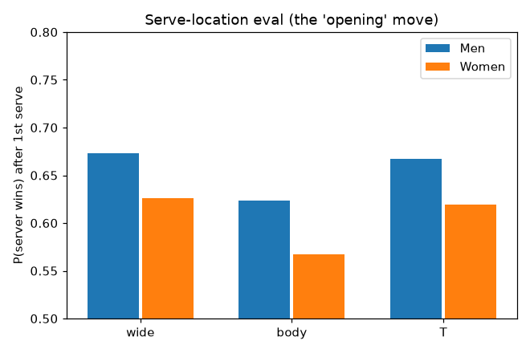
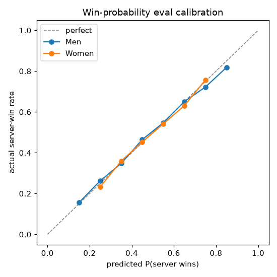
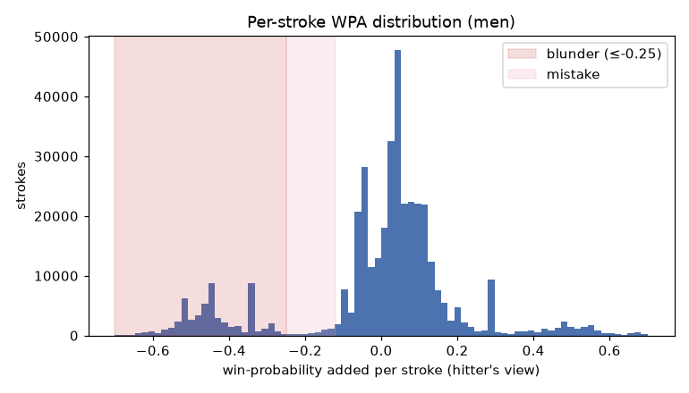

# Chess-style point analysis: win-probability & shot quality

*Generated by `experiments/chess_point_analysis/run.py`. Treats each point's shot notation as a move list, builds an empirical P(server wins) eval, and scores every stroke by win-probability added (WPA) — the centipawn-loss / blunder idea ported to tennis.*

## Serve as the opening move
- Men, P(server wins) after a 1st serve: wide **67.3%**, body **62.3%**, T **66.7%**
- Women, P(server wins) after a 1st serve: wide **62.6%**, body **56.7%**, T **61.9%**



## Richer state: the optional details now in the eval

Shot direction was always used; the rally state now also reads **return depth** (7/8/9), **slice vs drive**, and **net/approach** (+/- modifiers). Raw men's server-win% by each detail (marginal, so confounded — but the signal is clearly present):

- **Return depth** — deep(9) 46.7% · mid(8) 52.4% · shallow(7) 57.8%  (a deeper return weakens the serve hold)
- **Return type** — drive 60.2% vs slice 70.4%
- **Server approached the net** — yes 68.4% vs no 63.5%

## The eval is calibrated

Predicted win-probability tracks the actual server-win rate closely (held-in check), so per-stroke WPA is meaningful.



## Per-stroke WPA: where blunders live



## An annotated point (the 'annotated game')

```
serve 1st | server=P2 | outcome=unforced_error | won by P2
----------------------------------------------------------
 1. P2                   serve              P(srv win)=0.67  WPA=-0.052 
 2. P1                   forehand           P(srv win)=0.55  WPA=+0.112 
 3. P2                   forehand           P(srv win)=0.58  WPA=+0.029 
 4. P1                   backhand           P(srv win)=0.53  WPA=+0.052 
 5. P2                   backhand_slice     P(srv win)=0.45  WPA=-0.083 ?!
 6. P1                   forehand           P(srv win)=0.52  WPA=-0.067 ?!
 7. P2                   backhand_slice     P(srv win)=0.47  WPA=-0.049 
 8. P1                   backhand           P(srv win)=0.47  WPA=-0.004 
 9. P2                   backhand_slice     P(srv win)=0.46  WPA=-0.013 
10. P1                   backhand           P(srv win)=0.47  WPA=-0.013 
11. P2                   backhand_slice     P(srv win)=0.49  WPA=+0.014 
12. P1                   forehand           P(srv win)=0.44  WPA=+0.049 
13. P2                   backhand_slice     P(srv win)=0.41  WPA=-0.030 
14. P1                   backhand           P(srv win)=0.47  WPA=-0.066 ?!
15. P2                   backhand_slice     P(srv win)=0.49  WPA=+0.014 
16. P1                   forehand           P(srv win)=0.44  WPA=+0.043 
17. P2                   forehand           P(srv win)=0.56  WPA=+0.115 
18. P1                   backhand           P(srv win)=0.51  WPA=+0.048 
19. P2                   backhand_slice     P(srv win)=0.49  WPA=-0.025 
20. P1                   forehand           P(srv win)=0.29  WPA=+0.196 
21. P2                   backhand_lob       P(srv win)=0.15  WPA=-0.139 ?
22. P1                   overhead           P(srv win)=1.00  WPA=-0.850 ??
```

## Decision quality: win-probability conceded per stroke

Lower `avg_wpa_lost` = gives away less per stroke (the centipawn-loss analogue); `accuracy` rescales it 0–100, monotonically, so it reorders nobody. `unforced_lost_share` is how much of the loss came from charted *unforced* errors — the most self-inflicted.

**Read this leaderboard as style, not skill.** There is no oracle for the best stroke, so a loss blends selection, execution, and opponent pressure — and worse, WPA telescopes within a point, so the per-stroke average is identically *(concession per point) / (strokes per point)*. That second factor dominates: the metric correlates ≈ −0.85 with rally length and is ≈ 0.9 predictable from style out-of-fold, which leaves almost none of its spread as skill. `experiments/class_relative_wpa` measures this every run and is where the metric gets corrected into something reportable.

### Men — Slams & Masters, 2010+

| rank | player | shots | unforced | avg_wpa_lost | unforced_lost_share | accuracy |
|---|---|---|---|---|---|---|
| 1 | Roberto Bautista Agut | 6857 | 343 | 0.0559 | 44% | 71.5 |
| 2 | Tomas Martin Etcheverry | 4741 | 231 | 0.0574 | 41% | 70.9 |
| 3 | Andy Roddick | 2338 | 124 | 0.0579 | 45% | 70.7 |
| 4 | Gilles Simon | 6320 | 267 | 0.0586 | 35% | 70.4 |
| 5 | Luca Van Assche | 860 | 47 | 0.0590 | 46% | 70.2 |
| 6 | Marc Polmans | 882 | 38 | 0.0598 | 35% | 69.8 |
| 7 | David Ferrer | 8270 | 503 | 0.0608 | 48% | 69.4 |
| 8 | Brandon Holt | 886 | 52 | 0.0609 | 47% | 69.4 |
| 9 | Juan Pablo Varillas | 2010 | 122 | 0.0621 | 48% | 68.9 |
| 10 | Sebastian Baez | 2900 | 173 | 0.0626 | 46% | 68.7 |
| ... | | | | | | |
|  | Maxime Cressy | 1788 | 125 | 0.1001 | 34% | 54.8 |
|  | Christopher Eubanks | 2464 | 252 | 0.1067 | 48% | 52.7 |
|  | Reilly Opelka | 3971 | 458 | 0.1116 | 51% | 51.2 |

### Women — Slams & Masters, 2010+

| rank | player | shots | unforced | avg_wpa_lost | unforced_lost_share | accuracy |
|---|---|---|---|---|---|---|
| 1 | Caroline Wozniacki | 20027 | 734 | 0.0502 | 35% | 74.0 |
| 2 | Sara Sorribes Tormo | 4752 | 135 | 0.0518 | 27% | 73.3 |
| 3 | Kayla Day | 1410 | 51 | 0.0523 | 33% | 73.1 |
| 4 | Agnieszka Radwanska | 4857 | 160 | 0.0532 | 30% | 72.7 |
| 5 | Magdalena Frech | 2190 | 118 | 0.0551 | 47% | 71.9 |
| 6 | Evgeniya Rodina | 816 | 43 | 0.0566 | 45% | 71.2 |
| 7 | Angelique Kerber | 10234 | 499 | 0.0567 | 42% | 71.2 |
| 8 | Sara Errani | 3750 | 166 | 0.0567 | 38% | 71.2 |
| 9 | Katie Volynets | 1989 | 102 | 0.0598 | 42% | 69.8 |
| 10 | Renata Zarazua | 993 | 60 | 0.0604 | 48% | 69.6 |
| ... | | | | | | |
|  | Indy De Vroome | 989 | 107 | 0.1029 | 52% | 53.9 |
|  | Jelena Ostapenko | 4525 | 448 | 0.1039 | 48% | 53.6 |
|  | Solana Sierra | 1115 | 83 | 0.1058 | 37% | 53.0 |
