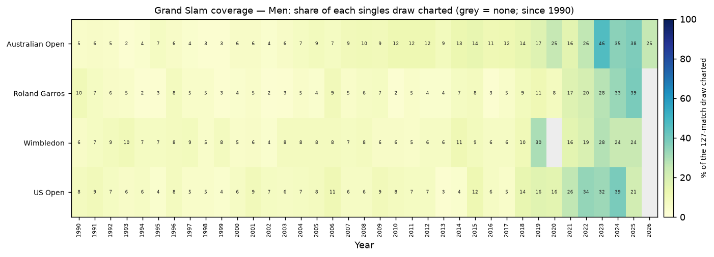
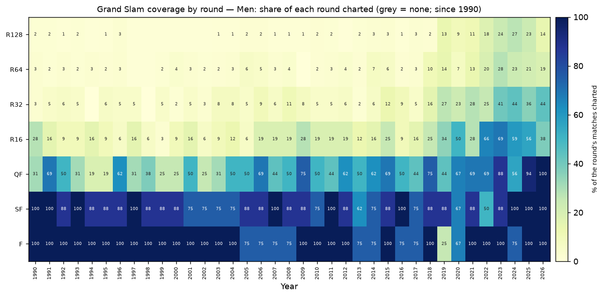
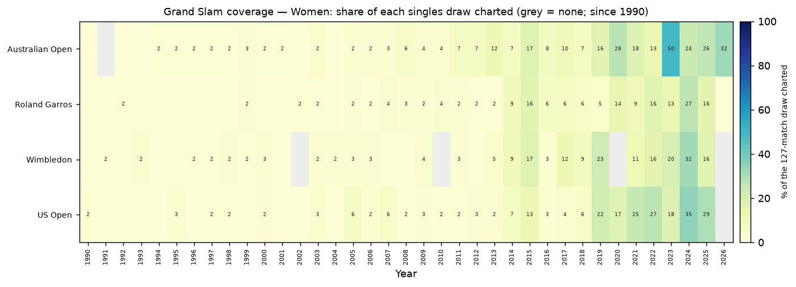
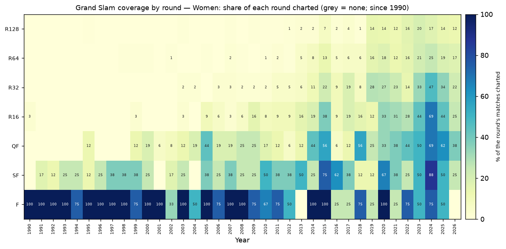
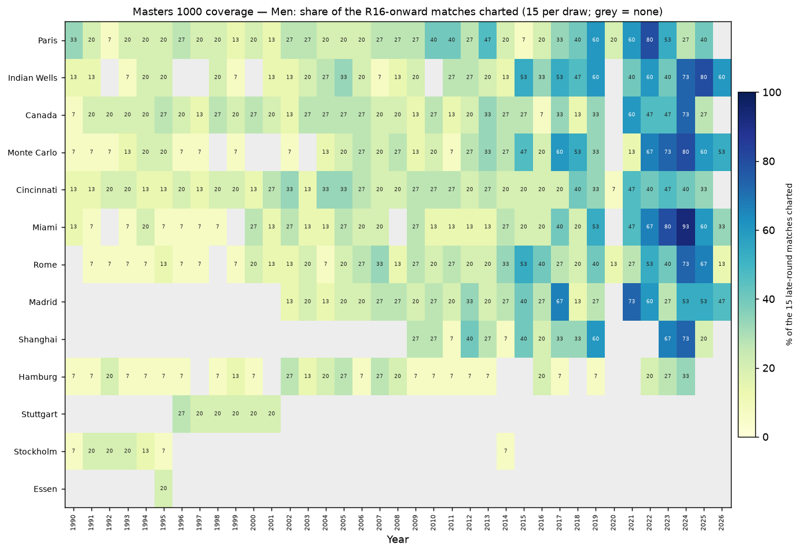
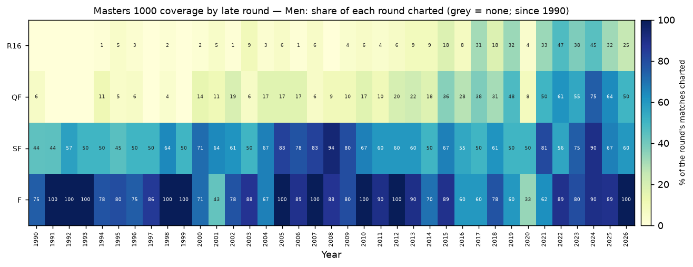
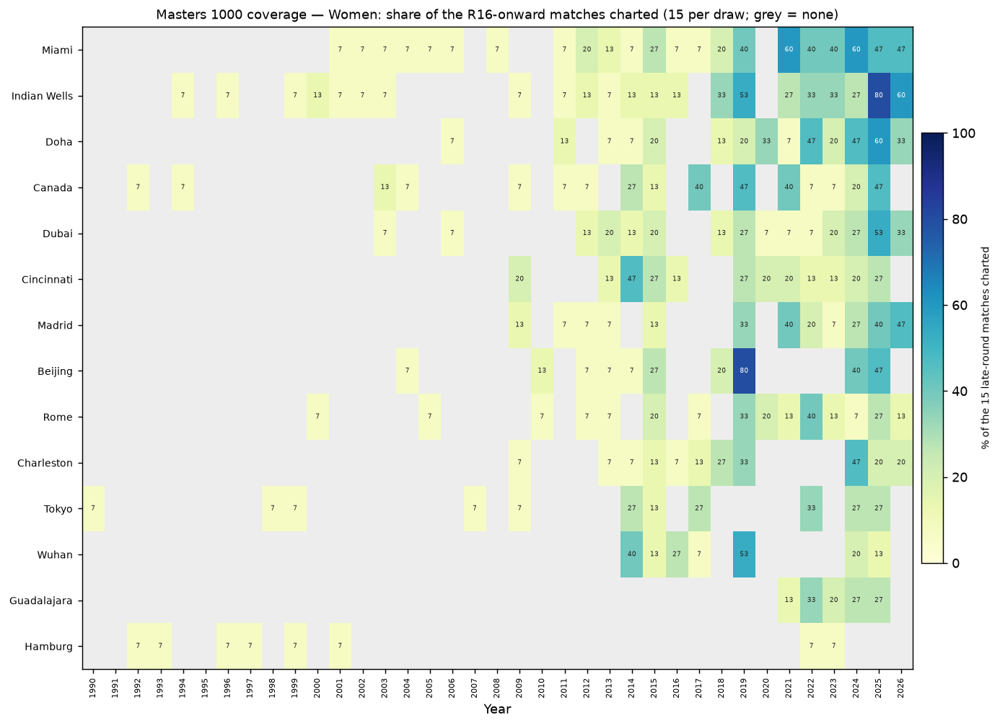
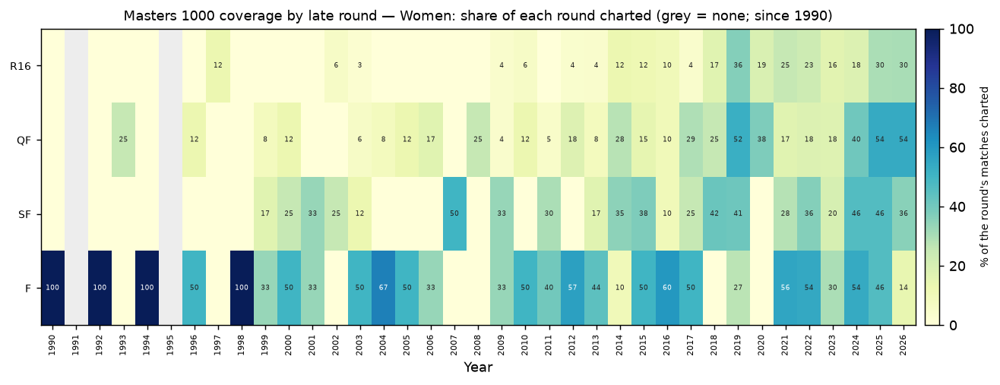

# Coverage summary

## Dataset totals
- Matches: **11,646** (7,566 men / 4,080 women)
- Points: **1,853,115**
- Distinct tournaments: **637**
- Date span: **1960-05-29 00:00:00 -> 2026-05-24 00:00:00**
- Tier-classified (not Other/Unknown): **99.8%**

## True coverage highlights (charted vs. played)
- **Men slams** — best draw Australian Open 2023 at **46%** (59/127); finals 91% vs R128 5%.
- **Men Masters 1000** — best draw Miami 2024 at **93%** (14/15); finals 83% vs R16 12%.
- **Women slams** — best draw Australian Open 2023 at **50%** (63/127); finals 74% vs R128 4%.
- **Women Masters 1000** — best draw Beijing 2019 at **80%** (12/15); finals 41% vs R16 14%.

## Grand Slam coverage (charted / 127-match draw, since 1990)
### Men
- 
- 
### Women
- 
- 

## Masters 1000 coverage (charted / 15 R16-onward matches, since 1990)
### Men
- 
- 
### Women
- 
- 
