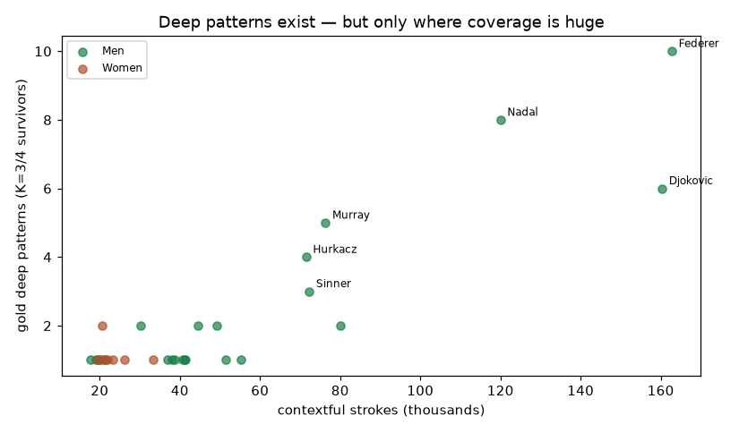

# Deep patterns — 3–4 shot sequences for the heavily charted

*Generated by `experiments/deep_patterns/run.py`. A deep context earns **gold** only if it beats its own (K−1)-shot parent (≥1.3×, exact binomial p<0.005), replicates above the parent in both match-hash halves, and meets the production support floor. Candidate pool: 57 men + 22 women with ≥10,000 charted points.*

| | gold patterns | K=3 | K=4 | players with ≥1 |
|---|---|---|---|---|
| Men | 57 | 50 | 7 | 23 |
| Women | 9 | 9 | 0 | 8 |

## Men

### Roger Federer — 10 gold patterns
- `FH slice→2 · FH drive→3 · BH drive→3` → goes for it 29% vs 15% without the first shot(s) (1.9× the parent), converts 56% ✅ (n=85)
- `BH drive→2 · BH drive→2 · FH drive→3 · BH drive→3` → goes for it 22% vs 12% without the first two shot(s) (1.9× the parent), converts 35% ⚠️ (n=104)
- `BH slice→2 · FH drive→1 · FH drive→3` → goes for it 26% vs 14% without the first shot(s) (1.8× the parent), converts 76% ✅ (n=81)
- `FH slice→2 · FH drive→1 · FH drive→2` → goes for it 41% vs 24% without the first shot(s) (1.7× the parent), converts 65% ✅ (n=75)
- `FH slice→2 · FH drive→3 · BH drive→2` → goes for it 42% vs 24% without the first shot(s) (1.7× the parent), converts 71% ✅ (n=84)

### Novak Djokovic — 6 gold patterns
- `BH drive→3 · BH drive→3 · FH drive→1 · FH drive→1` → goes for it 25% vs 12% without the first two shot(s) (2.1× the parent), converts 35% ⚠️ (n=67)
- `BH slice→2 · FH drive→1 · FH drive→3` → goes for it 19% vs 9% without the first shot(s) (2.0× the parent), converts 67% ✅ (n=145)
- `FH slice→2 · FH drive→3 · BH drive→2` → goes for it 26% vs 14% without the first shot(s) (1.9× the parent), converts 65% ✅ (n=117)
- `FH slice→2 · FH drive→3 · BH drive→3` → goes for it 22% vs 13% without the first shot(s) (1.7× the parent), converts 66% ✅ (n=132)
- `BH slice→2 · FH drive→3 · BH drive→2` → goes for it 20% vs 14% without the first shot(s) (1.5× the parent), converts 56% ✅ (n=220)

### Rafael Nadal — 8 gold patterns
- `BH slice→2 · FH drive→3 · BH drive→1` → goes for it 20% vs 10% without the first shot(s) (2.1× the parent), converts 62% ✅ (n=79)
- `FH slice→2 · FH drive→3 · BH drive→2` → goes for it 28% vs 14% without the first shot(s) (2.0× the parent), converts 62% ✅ (n=75)
- `BH slice→2 · FH drive→3 · FH drive→3 · BH drive→3` → goes for it 32% vs 17% without the first two shot(s) (2.0× the parent), converts 57% ✅ (n=65)
- `BH slice→2 · FH drive→1 · FH drive→2` → goes for it 30% vs 16% without the first shot(s) (1.9× the parent), converts 62% ✅ (n=80)
- `BH slice→3 · FH drive→1 · FH drive→2` → goes for it 29% vs 16% without the first shot(s) (1.8× the parent), converts 48% ⚠️ (n=79)

## Women

### Serena Williams — 1 gold patterns
- `serve T · BH drive→2 · FH drive→1` → goes for it 29% vs 17% without the first shot(s) (1.7× the parent), converts 8% ⚠️ (n=86)

## Verdict

**Viable as a gold-star tier.** 66 deep patterns survive the triple gate across 31 players (median 1 per covered player). These are exactly the "only visible with huge coverage" sequences worth a ⭐ in the drawer — shipped via the insights build, shown only when a player has them.
