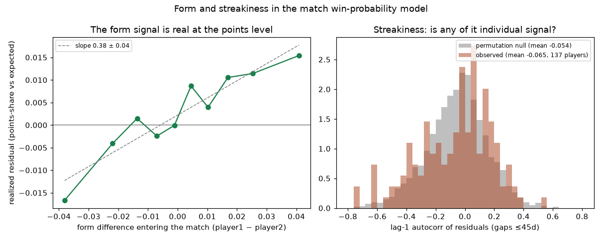

# Form and streakiness in match win probability

*Generated by `experiments/form_streakiness/run.py`. Form = shrunk mean of a player's last 10 opponent-adjusted residuals within 540 days; the form arm shifts matchup point-win probs by `w·(form₁−form₂)` with `w` tuned pre-2020 and judged on 2020+. The streaky arm scales each player's form by their training-era gap-limited residual autocorrelation (test era only — see README for why). Same score tree and walk-forward discipline everywhere.*

## Does uniform form help?

Training-era log-loss: baseline 0.6836; w=0.25: 0.6779; w=0.5: 0.6841; w=0.75: 0.7017; w=1.0: 0.7299; w=1.5: 0.8162. Best: **w=0.25**.

| | matches | log-loss base | log-loss form | Δ (95% CI) |
|---|---|---|---|---|
| Men | 2,812 | 0.6242 | 0.6247 | +0.0005 (-0.0038, +0.0048) |
| Women | 1,816 | 0.6770 | 0.6801 | +0.0031 (-0.0026, +0.0090) |

## Does individual streakiness modulation beat uniform form?

| | matches | log-loss uniform | log-loss streaky | Δ (95% CI) |
|---|---|---|---|---|
| Men | 2,812 | 0.6247 | 0.6253 | +0.0006 (-0.0006, +0.0017) |
| Women | 1,816 | 0.6801 | 0.6806 | +0.0005 (-0.0006, +0.0016) |

## Diagnostics (model-free)

- **Form signal:** regressing a match's realized residual on the form difference entering it gives slope **0.38 ± 0.04** (test era, n=4,628) — recent residuals do carry some information about the next charted match.
- **Streakiness signal:** per-player residual autocorrelation over ≤45-day gaps: observed mean **-0.065** across 137 players vs permutation-null mean **-0.054** — the distributions nearly coincide (right panel), so there is little *stable individual* streakiness to modulate by.

## Verdict

**Uniform form does not pay as designed** — and the diagnostics explain why that isn't a contradiction. The form signal is real (slope 0.38, ~8σ) but *small in absolute terms*: the extreme form deciles differ by only ~±1.5 points per hundred in realized points-share, which moves a pre-match win probability by a couple of points — well inside the noise of a binary outcome over a few thousand test matches. Part of the slope is also just stale career rates catching up (an improving player runs persistently positive residuals until their counters absorb it), which the walk-forward baseline corrects on its own schedule anyway. A decisive answer needs a dense match history — full tour results (the `tennis_atp`/`tennis_wta` repos), not the charted sample's ~monthly snapshots of a player.

**Streakiness modulation does not beat uniform form**, consistent with the null-test finding that per-player autocorrelation is mostly noise at charted-data resolution.

