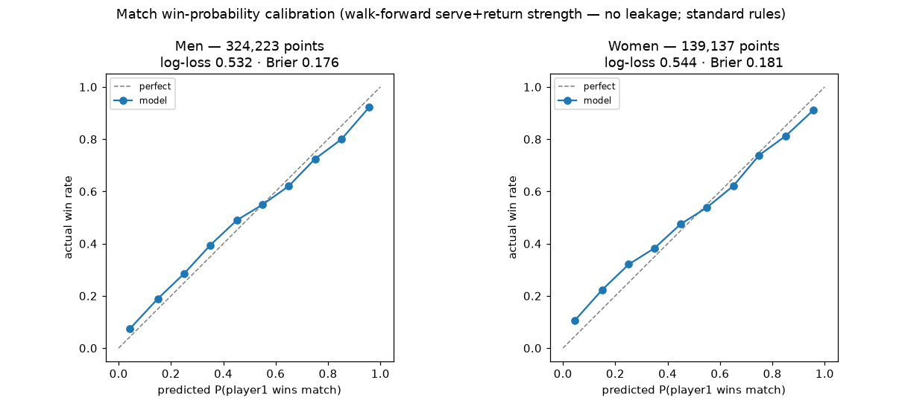
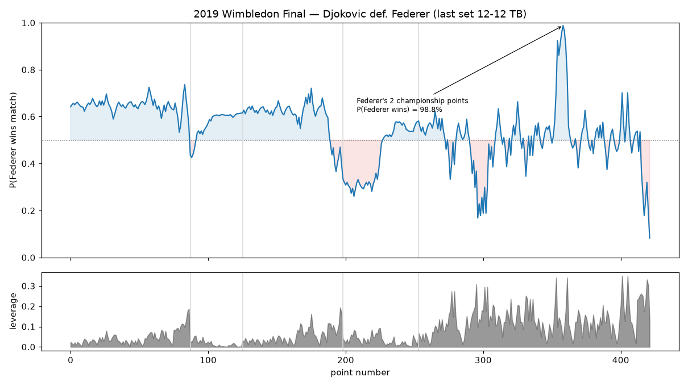

# Match win-probability — the score-tree layer

*Generated by `experiments/match_winprob/run.py`. An analytic point→game→set→match win-probability model, driven by each player's serve+return strength (estimated **walk-forward** — only matches played earlier, so nothing leaks), sitting on top of the point eval. Validated three ways below.*

## Validation

1. **Internally exact** — the model satisfies the martingale identity `WP = P(win pt)·WP(after win) + P(lose pt)·WP(after lose)` to machine precision (max error ~2e-16 over 40k random states, best-of-3 and -5).
2. **Calibrated against real outcomes** — model WP at every point vs the eventual winner, over a 1/4 match sample:

| | points | log-loss | Brier |
|---|---|---|---|
| Men | 324,223 | 0.532 | 0.176 |
| Women | 139,137 | 0.544 | 0.181 |

Predicted and actual win rates track the diagonal across all deciles. Because each match is scored only from *earlier* matches, this is a genuine out-of-sample test — no information from the match or the future leaks into its own prediction.
3. **Face-valid on a marquee match** — see the curve below.

## Live win probability — 2019 Wimbledon Final — Djokovic def. Federer (last set 12-12 TB)

Federer's win probability peaked at **98.8%** serving at 8-7, 40-15 in the fifth — two championship points — then fell away as Djokovic saved them and won the deciding tiebreak. The lower panel is **leverage**: how much each point could swing the match.

### Highest-leverage points of the match

| leverage (match-WP swing) | situation |
|---|---|
| 0.350 | set 2-2, games 11-11, 40-AD (Djo serving) |
| 0.350 | set 2-2, games 11-11, 40-AD (Djo serving) |
| 0.341 | set 2-2, games 8-7, 40-AD (Fed serving) |
| 0.340 | set 2-2, games 7-7, 30-40 (Djo serving) |
| 0.332 | set 2-2, games 12-12, 4-3 (Djo serving) |
| 0.308 | set 2-2, games 2-3, 30-40 (Fed serving) |
| 0.302 | set 2-2, games 12-12, 5-3 (Djo serving) |
| 0.295 | set 2-2, games 2-4, 30-40 (Djo serving) |

## Shot quality in match units (the point eval × leverage)

The point eval scores every shot's WPA in *point*-win units; multiplying by the point's leverage re-expresses it in *match*-win units. The biggest match-costing shots of the final (most negative match-WPA):

| match-WPA | shot | situation |
|---|---|---|
| -0.241 | returner forehand | set 2-2, games 7-7, 30-40 (Djo serving) |
| -0.160 | server forehand | set 2-2, games 8-7, 40-AD (Fed serving) |
| -0.154 | server forehand_swinging_volley | set 2-2, games 12-12, 1-1 (Fed serving) |
| -0.141 | server backhand_volley | set 2-2, games 2-3, 30-40 (Fed serving) |
| -0.129 | server forehand | set 2-2, games 2-4, 40-AD (Djo serving) |
| -0.106 | server forehand | set 2-2, games 7-7, 30-30 (Djo serving) |
| -0.091 | server serve | set 2-2, games 2-4, 30-30 (Djo serving) |
| -0.089 | server backhand | set 0-0, games 6-6, 5-6 (Fed serving) |

This is the chess-analogue completion: a blunder is finally priced in the units that decide the match, not the point — the same error costs far more on a championship point than at 40-0. **Caveat:** like the point eval, this conflates shot selection, execution, and opponent pressure; strength is a serve+return rate with no surface or form adjustment, and players with thin prior charting fall back toward an even matchup.
