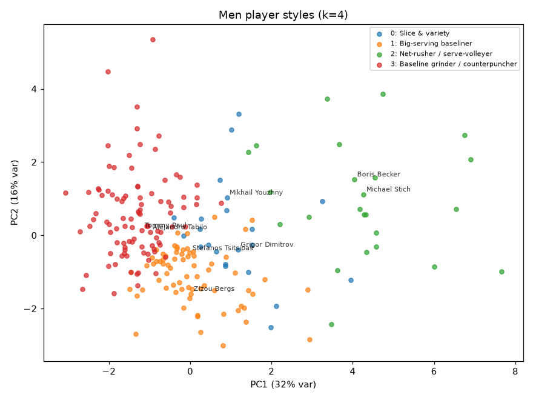
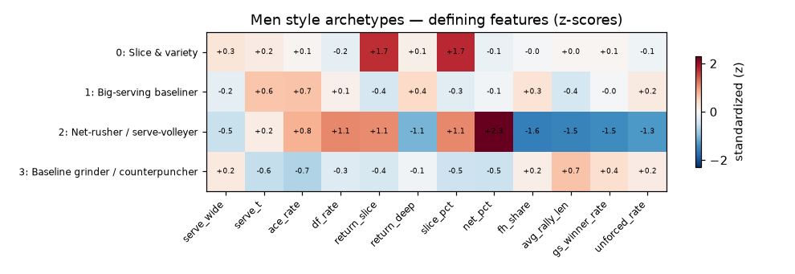
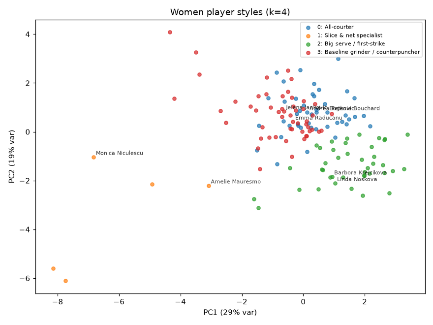
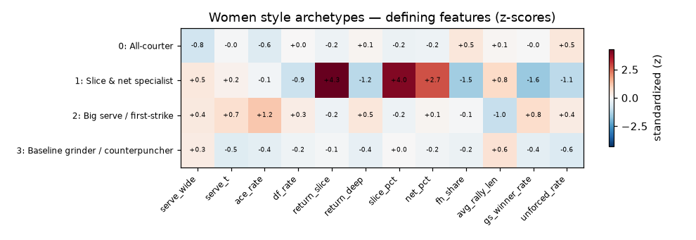

# Player styles: fingerprint → clusters

*Generated by `experiments/player_styles/run.py`. Each player is a vector of shot tendencies (serve location, slice/net rates, forehand share, rally length, shotmaking) built from the decoded notation; k-means groups them into archetypes. Style is a continuum, so silhouette scores are modest — treat clusters as soft strata, not species.*

## Men — 215 players, 4 archetypes (silhouette 0.14)

### 0. Slice & variety — 22 players
- **Defining:** ↑slice_pct  ↑return_slice  ↑serve_wide
- **Exemplars:** Grigor Dimitrov, Mikhail Youzhny, Daniel Altmaier, Robin Haase, Roger Federer, Lorenzo Musetti

### 1. Big-serving baseliner — 71 players
- **Defining:** ↑ace_rate  ↑serve_t  ↑return_deep
- **Exemplars:** Stefanos Tsitsipas, Zizou Bergs, Tomas Berdych, Lucas Pouille, Jesper De Jong, Felix Auger Aliassime

### 2. Net-rusher / serve-volleyer — 24 players
- **Defining:** ↑net_pct  ↓fh_share  ↓avg_rally_len
- **Exemplars:** Boris Becker, Michael Stich, Mark Philippoussis, Tim Henman, Pete Sampras, John Mcenroe

### 3. Baseline grinder / counterpuncher — 98 players
- **Defining:** ↓ace_rate  ↑avg_rally_len  ↓serve_t
- **Exemplars:** Tommy Paul, Alejandro Tabilo, Novak Djokovic, Jannik Sinner, David Goffin, Carlos Alcaraz

## Women — 144 players, 4 archetypes (silhouette 0.12)

### 0. All-courter — 45 players
- **Defining:** ↓serve_wide  ↓ace_rate  ↑fh_share
- **Exemplars:** Eugenie Bouchard, Andrea Petkovic, Bianca Andreescu, Maria Sakkari, Diana Shnaider, Lauren Davis

### 1. Slice & net specialist — 5 players
- **Defining:** ↑return_slice  ↑slice_pct  ↑net_pct
- **Exemplars:** Monica Niculescu, Amelie Mauresmo, Steffi Graf, Tatjana Maria, Martina Navratilova

### 2. Big serve / first-strike — 41 players
- **Defining:** ↑ace_rate  ↓avg_rally_len  ↑gs_winner_rate
- **Exemplars:** Linda Noskova, Barbora Krejcikova, Clara Tauson, Anett Kontaveit, Ana Ivanovic, Elena Rybakina

### 3. Baseline grinder / counterpuncher — 53 players
- **Defining:** ↑avg_rally_len  ↓unforced_rate  ↓serve_t
- **Exemplars:** Jelena Jankovic, Emma Raducanu, Anhelina Kalinina, Marie Bouzkova, Mirra Andreeva, Elise Mertens

