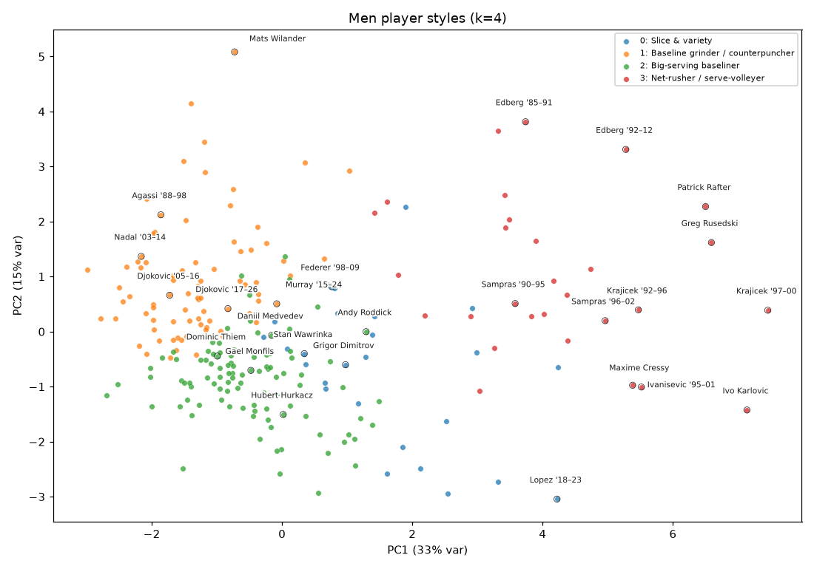
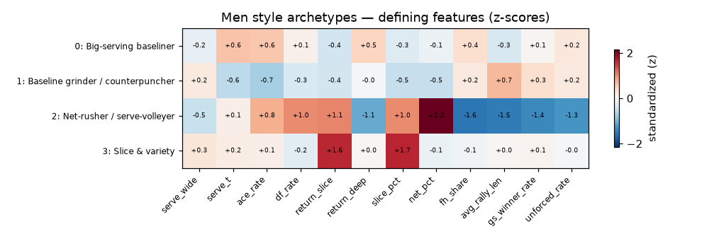
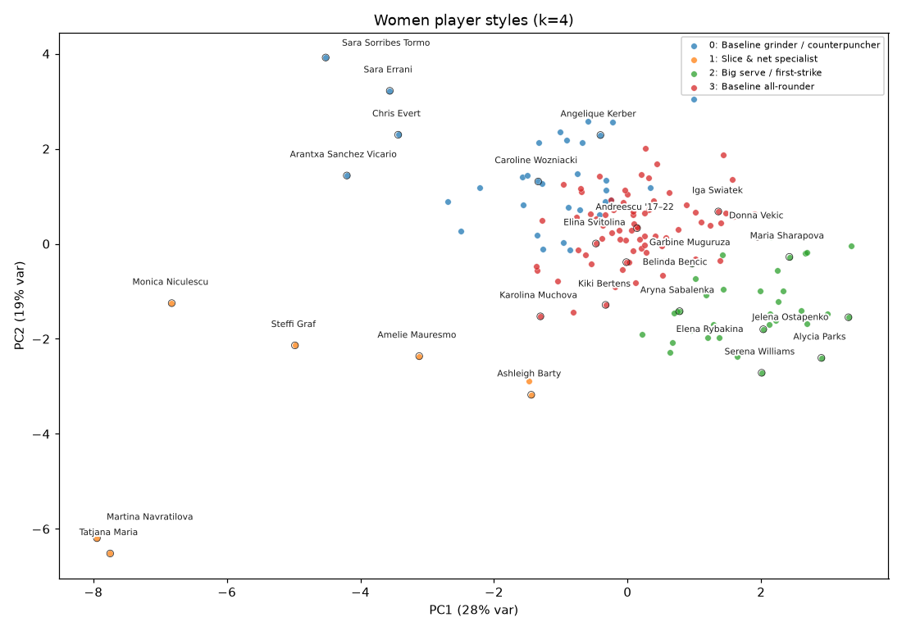
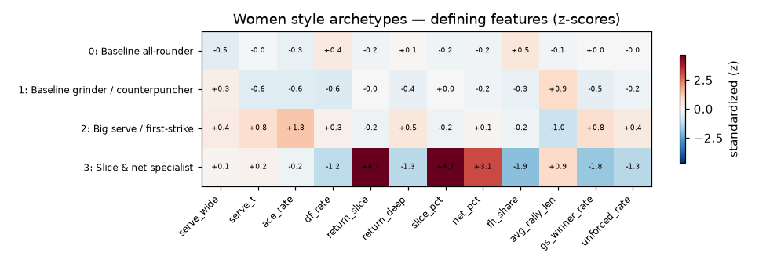

# Player styles: fingerprint → clusters

*Generated by `experiments/player_styles/run.py`. Each player is a vector of shot tendencies (serve location, slice/net rates, forehand share, rally length, shotmaking) built from the decoded notation; k-means groups them into archetypes. Style is a continuum, so silhouette scores are modest — treat clusters as soft strata, not species.*

*Long, evolving careers are split into early/late **era entities** via the `player_eras` layer, so each era clusters on its own — see “Career-era splits” below.*

## Men — 242 entities, 4 archetypes (silhouette 0.14)

### 0. Big-serving baseliner — 80 players
- **Defining:** ↑serve_t  ↑ace_rate  ↑return_deep
- **Exemplars:** Karen Khachanov (2015–2022), Stefanos Tsitsipas (2023–2026), Zizou Bergs, Tomas Berdych (2005–2013), Lucas Pouille, Jesper De Jong

### 1. Baseline grinder / counterpuncher — 105 players
- **Defining:** ↓ace_rate  ↑avg_rally_len  ↓serve_t
- **Exemplars:** Novak Djokovic (2005–2016), Tommy Paul, Alejandro Tabilo, Jannik Sinner (2013–2023), David Goffin, Carlos Alcaraz

### 2. Net-rusher / serve-volleyer — 31 players
- **Defining:** ↑net_pct  ↓fh_share  ↓avg_rally_len
- **Exemplars:** Boris Becker (1991–1999), Michael Stich, Mark Philippoussis, Boris Becker (1985–1990), Richard Krajicek (1992–1996), John Mcenroe (1978–1985)

### 3. Slice & variety — 26 players
- **Defining:** ↑slice_pct  ↑return_slice  ↑serve_wide
- **Exemplars:** Grigor Dimitrov, Roger Federer (2010–2021), Mikhail Youzhny, Daniel Altmaier, Robin Haase, Stan Wawrinka

## Women — 152 entities, 4 archetypes (silhouette 0.11)

### 0. Baseline all-rounder — 60 players
- **Defining:** ↑fh_share  ↓serve_wide  ↑df_rate
- **Exemplars:** Andrea Petkovic, Leylah Fernandez, Bianca Andreescu (2017–2022), Maria Sakkari, Eugenie Bouchard (2017–2023), Elise Mertens

### 1. Baseline grinder / counterpuncher — 49 players
- **Defining:** ↑avg_rally_len  ↓df_rate  ↓serve_t
- **Exemplars:** Jelena Jankovic, Marie Bouzkova, Anhelina Kalinina, Emma Raducanu, Mirra Andreeva, Flavia Pennetta

### 2. Big serve / first-strike — 39 players
- **Defining:** ↑ace_rate  ↓avg_rally_len  ↑serve_t
- **Exemplars:** Linda Noskova, Barbora Krejcikova, Clara Tauson, Elena Rybakina, Veronika Kudermetova, Coco Vandeweghe

### 3. Slice & net specialist — 4 players
- **Defining:** ↑return_slice  ↑slice_pct  ↑net_pct
- **Exemplars:** Monica Niculescu, Tatjana Maria, Steffi Graf, Martina Navratilova

## Career-era splits (via the `player_eras` layer)

35 evolving careers were split into early/late entities and fingerprinted independently. Where the eras land in **different** archetypes, the split captured a real style shift:

**Diverged into different archetypes (5):**
- **Alexander Bublik** (M) — 2017–2023: Net-rusher / serve-volleyer → 2024–2026: Big-serving baseliner
- **Karen Khachanov** (M) — 2015–2022: Big-serving baseliner → 2023–2026: Baseline grinder / counterpuncher
- **Michael Chang** (M) — 1989–1994: Baseline grinder / counterpuncher → 1995–1998: Big-serving baseliner
- **Daria Kasatkina** (W) — 2015–2022: Baseline grinder / counterpuncher → 2023–2026: Baseline all-rounder
- **Jessica Pegula** (W) — 2015–2024: Baseline all-rounder → 2025–2026: Baseline grinder / counterpuncher

**Stayed in one archetype (30):** Alexander Zverev (M), Andre Agassi (M), Andrey Rublev (M), Andy Murray (M), Benoit Paire (M), Boris Becker (M), David Ferrer (M), Feliciano Lopez (M), Goran Ivanisevic (M), Ivan Lendl (M), Jannik Sinner (M), Jimmy Connors (M), John Mcenroe (M), Juan Martin Del Potro (M), Lleyton Hewitt (M), Novak Djokovic (M), Pete Sampras (M), Rafael Nadal (M), Richard Krajicek (M), Roger Federer (M), Stefan Edberg (M), Stefanos Tsitsipas (M), Tim Henman (M), Tomas Berdych (M), Bianca Andreescu (W), Eugenie Bouchard (W), Karolina Pliskova (W), Magda Linette (W), Venus Williams (W), Victoria Azarenka (W)
