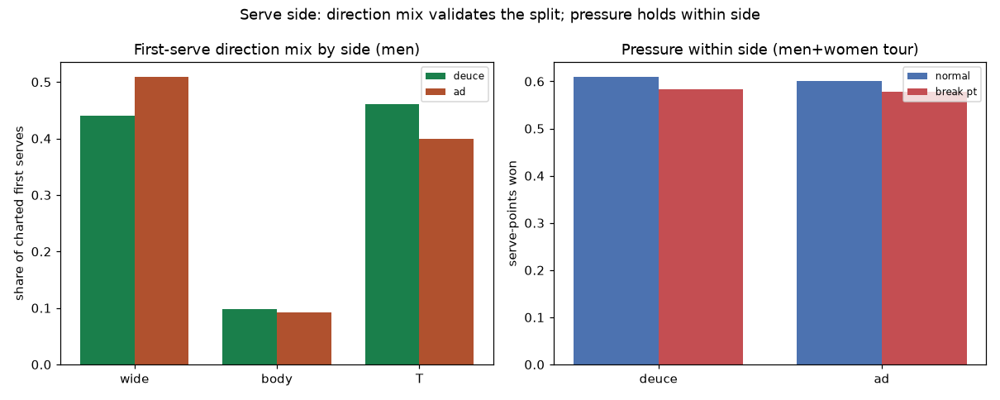

# Serve side — deuce vs ad court

*Generated by `experiments/serve_side/run.py`. Side is derived from the game score (`shots/score.py`): every game and tiebreak opens on the deuce court, then alternates each point. First-serve **direction mix** is over serves whose target is charted; **serve-points-won** is split by which delivery started the point. Rates carry their denominators.*

## Men

### Tour-wide splits

| side | points | 1st in | wide/body/T | ace | DF | 1st-serve won | 2nd-serve won |
|---|--:|--:|:-:|--:|--:|--:|--:|
| deuce | 664,007 | 63% | 44%/10%/46% | 8.8% | 3.4% | 73% | 51% |
| ad | 605,492 | 61% | 51%/9%/40% | 7.7% | 3.5% | 71% | 51% |

### Heavily-charted players (both sides ≥ 2,000 charted points)

| player | side | pts | 1st in | wide/T | ace | DF | 1st won | 2nd won |
|---|---|--:|--:|:-:|--:|--:|--:|--:|
| Roger Federer | deuce | 31,375 | 64% | 46%/46% | 10.9% | 2.2% | 78% | 56% |
|  | ad | 28,450 | 61% | 56%/38% | 9.4% | 2.2% | 76% | 57% |
| Novak Djokovic | deuce | 23,958 | 66% | 46%/45% | 7.3% | 2.6% | 74% | 55% |
|  | ad | 21,711 | 64% | 51%/40% | 7.0% | 3.0% | 72% | 55% |
| Rafael Nadal | deuce | 18,094 | 67% | 30%/51% | 3.8% | 2.4% | 70% | 55% |
|  | ad | 16,440 | 70% | 54%/28% | 4.7% | 2.2% | 71% | 56% |
| Pete Sampras | deuce | 11,389 | 59% | 42%/52% | 15.3% | 4.9% | 82% | 55% |
|  | ad | 10,292 | 58% | 42%/52% | 13.1% | 4.3% | 79% | 53% |
| Andre Agassi | deuce | 10,556 | 63% | 50%/41% | 5.5% | 2.7% | 71% | 54% |
|  | ad | 9,732 | 64% | 59%/37% | 4.8% | 2.7% | 69% | 55% |

### Step 2 — serve-points-won by leverage, within each side

*Tour-wide. Holding the side fixed and varying leverage isolates the pressure effect from the side effect.*

| side | normal | break pt | game pt | break−normal |
|---|--:|--:|--:|--:|
| deuce | 65% (456,828) | 61% (24,626) | 67% (72,375) | -3% |
| ad | 64% (331,721) | 61% (78,552) | 65% (170,724) | -3% |

Per player (break−normal on each side, the pressure swing net of side):

**Roger Federer**

| side | normal | break pt | game pt | break−normal |
|---|--:|--:|--:|--:|
| deuce | 70% (22,290) | 69% (773) | 70% (3,855) | -2% |
| ad | 68% (15,981) | 65% (2,645) | 70% (8,605) | -3% |

**Novak Djokovic**

| side | normal | break pt | game pt | break−normal |
|---|--:|--:|--:|--:|
| deuce | 67% (16,782) | 64% (729) | 69% (2,781) | -3% |
| ad | 67% (12,100) | 64% (2,389) | 66% (6,472) | -3% |

**Rafael Nadal**

| side | normal | break pt | game pt | break−normal |
|---|--:|--:|--:|--:|
| deuce | 65% (12,706) | 63% (575) | 68% (2,072) | -3% |
| ad | 67% (9,152) | 64% (2,009) | 68% (4,701) | -3% |

**Pete Sampras**

| side | normal | break pt | game pt | break−normal |
|---|--:|--:|--:|--:|
| deuce | 71% (7,923) | 65% (275) | 71% (1,436) | -6% |
| ad | 68% (5,676) | 69% (921) | 67% (3,167) | +1% |

**Andre Agassi**

| side | normal | break pt | game pt | break−normal |
|---|--:|--:|--:|--:|
| deuce | 65% (7,290) | 62% (375) | 64% (1,162) | -3% |
| ad | 64% (5,322) | 63% (1,259) | 65% (2,836) | -1% |

### Step 3 — serve+1 (server's first groundstroke), by side

*FH share = how often the serve+1 is a forehand; attempt = winner or unforced error; claims stay in server-wing / side terms (no returner handedness assumed).*

| player | side | serve+1 | FH share | attempt rate | convert |
|---|---|--:|--:|--:|--:|
| Roger Federer | deuce | 19,614 | 69% | 24% | 59% |
|  | ad | 18,218 | 65% | 24% | 57% |
| Novak Djokovic | deuce | 16,218 | 60% | 17% | 54% |
|  | ad | 15,101 | 52% | 17% | 51% |
| Rafael Nadal | deuce | 13,333 | 75% | 13% | 49% |
|  | ad | 11,742 | 80% | 17% | 60% |
| Pete Sampras | deuce | 5,615 | 46% | 27% | 60% |
|  | ad | 5,529 | 49% | 28% | 56% |
| Andre Agassi | deuce | 7,120 | 50% | 17% | 47% |
|  | ad | 6,813 | 51% | 19% | 49% |

## Women

### Tour-wide splits

| side | points | 1st in | wide/body/T | ace | DF | 1st-serve won | 2nd-serve won |
|---|--:|--:|:-:|--:|--:|--:|--:|
| deuce | 294,804 | 63% | 42%/21%/37% | 4.5% | 4.9% | 65% | 45% |
| ad | 271,928 | 62% | 42%/19%/39% | 3.8% | 4.8% | 63% | 46% |

### Heavily-charted players (both sides ≥ 2,000 charted points)

| player | side | pts | 1st in | wide/T | ace | DF | 1st won | 2nd won |
|---|---|--:|--:|:-:|--:|--:|--:|--:|
| Serena Williams | deuce | 5,025 | 60% | 50%/42% | 12.8% | 4.4% | 73% | 46% |
|  | ad | 4,600 | 61% | 45%/49% | 10.3% | 4.6% | 71% | 47% |
| Iga Swiatek | deuce | 7,250 | 64% | 39%/33% | 4.2% | 3.3% | 69% | 53% |
|  | ad | 6,618 | 63% | 39%/33% | 3.6% | 3.6% | 68% | 52% |
| Steffi Graf | deuce | 3,224 | 67% | 50%/36% | 4.8% | 3.4% | 66% | 51% |
|  | ad | 2,977 | 66% | 57%/30% | 3.4% | 2.4% | 65% | 51% |

### Step 2 — serve-points-won by leverage, within each side

*Tour-wide. Holding the side fixed and varying leverage isolates the pressure effect from the side effect.*

| side | normal | break pt | game pt | break−normal |
|---|--:|--:|--:|--:|
| deuce | 57% (199,856) | 55% (15,532) | 59% (26,764) | -2% |
| ad | 57% (146,787) | 55% (48,305) | 57% (70,653) | -2% |

Per player (break−normal on each side, the pressure swing net of side):

**Serena Williams**

| side | normal | break pt | game pt | break−normal |
|---|--:|--:|--:|--:|
| deuce | 63% (3,464) | 60% (188) | 64% (544) | -3% |
| ad | 62% (2,538) | 60% (689) | 63% (1,269) | -2% |

**Iga Swiatek**

| side | normal | break pt | game pt | break−normal |
|---|--:|--:|--:|--:|
| deuce | 63% (5,087) | 63% (295) | 63% (801) | -0% |
| ad | 63% (3,709) | 59% (903) | 63% (1,908) | -3% |

**Martina Navratilova**

| side | normal | break pt | game pt | break−normal |
|---|--:|--:|--:|--:|
| deuce | 57% (933) | 59% (82) | 61% (127) | +2% |
| ad | 56% (693) | 58% (217) | 63% (317) | +2% |

**Steffi Graf**

| side | normal | break pt | game pt | break−normal |
|---|--:|--:|--:|--:|
| deuce | 62% (2,206) | 57% (134) | 62% (318) | -4% |
| ad | 60% (1,593) | 58% (476) | 60% (829) | -3% |

### Step 3 — serve+1 (server's first groundstroke), by side

*FH share = how often the serve+1 is a forehand; attempt = winner or unforced error; claims stay in server-wing / side terms (no returner handedness assumed).*

| player | side | serve+1 | FH share | attempt rate | convert |
|---|---|--:|--:|--:|--:|
| Serena Williams | deuce | 3,017 | 50% | 23% | 43% |
|  | ad | 2,868 | 40% | 23% | 48% |
| Iga Swiatek | deuce | 5,037 | 57% | 20% | 50% |
|  | ad | 4,643 | 49% | 21% | 51% |
| Martina Navratilova | deuce | 910 | 46% | 16% | 57% |
|  | ad | 762 | 45% | 24% | 69% |
| Steffi Graf | deuce | 2,355 | 63% | 19% | 42% |
|  | ad | 2,296 | 64% | 18% | 38% |

