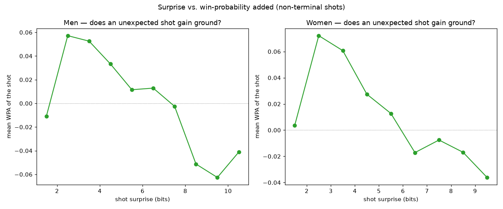
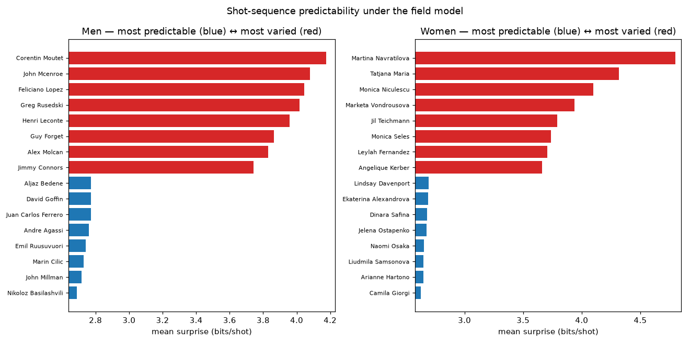

# Shot-sequence language model

*Generated by `experiments/shot_language/run.py`. Each point is a sentence in a small shot alphabet; an order-2 Markov model is the 'opening book'. Surprise = −log₂ P(next shot | last two), in bits — a player's mean surprise is how far their shot choices stray from tour norms.*

## Men — 189 players, per-shot perplexity 8.4

**Common phrases** (frequent two-shot context → likeliest next shot):
- `BH drive→3 · BH drive→3` → **BH drive→3**
- `FH drive→1 · FH drive→1` → **FH drive→3**
- `FH drive→3 · BH drive→3` → **BH drive→3**
- `BH drive→2 · FH drive→1` → **FH drive→1**
- `FH drive→1 · FH drive→3` → **<end>**

**Predictability leaderboard** (mean bits/shot):

| most varied | bits | | most predictable | bits |
|---|---|---|---|---|
| Corentin Moutet | 4.18 | | Nikoloz Basilashvili | 2.69 |
| John Mcenroe | 4.08 | | John Millman | 2.72 |
| Feliciano Lopez | 4.04 | | Marin Cilic | 2.73 |
| Greg Rusedski | 4.02 | | Emil Ruusuvuori | 2.74 |
| Henri Leconte | 3.96 | | Andre Agassi | 2.76 |
| Guy Forget | 3.86 | | Juan Carlos Ferrero | 2.77 |

**Signature patterns** of the most varied players (lift vs. field):
- **Corentin Moutet**: FH drive→1 → **BH slice→1** (25.1×); FH drive→3 → **FH drive→3** (8.5×); FH drive→1 → **BH drive→2** (6.4×); BH drive→3 → **FH drive→1** (5.6×)
- **John Mcenroe**: FH drive→3 → **FH net→3** (83.7×); BH drive→3 → **FH net→1** (70.2×); BH drive→1 → **BH net→3** (49.9×); FH drive→1 → **BH slice→3** (20.9×)
- **Feliciano Lopez**: FH drive→1 → **BH slice→1** (38.9×); BH drive→1 → **BH slice→1** (37.2×); FH drive→1 → **BH slice→3** (25.1×); FH drive→1 → **BH slice→2** (23.4×)

## Women — 124 players, per-shot perplexity 8.0

**Common phrases** (frequent two-shot context → likeliest next shot):
- `FH drive→1 · FH drive→1` → **FH drive→1**
- `BH drive→3 · BH drive→3` → **BH drive→3**
- `FH drive→3 · BH drive→3` → **BH drive→3**
- `BH drive→2 · FH drive→1` → **FH drive→1**
- `FH drive→1 · FH drive→3` → **<end>**

**Predictability leaderboard** (mean bits/shot):

| most varied | bits | | most predictable | bits |
|---|---|---|---|---|
| Martina Navratilova | 4.80 | | Camila Giorgi | 2.63 |
| Tatjana Maria | 4.32 | | Arianne Hartono | 2.65 |
| Monica Niculescu | 4.10 | | Liudmila Samsonova | 2.65 |
| Marketa Vondrousova | 3.94 | | Naomi Osaka | 2.65 |
| Jil Teichmann | 3.79 | | Jelena Ostapenko | 2.68 |
| Monica Seles | 3.74 | | Dinara Safina | 2.68 |

**Signature patterns** of the most varied players (lift vs. field):
- **Martina Navratilova**: FH drive→1 → **BH slice→1** (82.8×); BH drive→1 → **BH slice→1** (81.3×); FH drive→1 → **BH slice→3** (61.1×); FH drive→1 → **BH slice→2** (29.9×)
- **Tatjana Maria**: FH drive→1 → **FH slice→1** (13.2×); FH drive→1 → **FH slice→2** (11.2×); FH drive→3 → **BH slice→3** (8.7×); BH drive→3 → **BH slice→3** (8.5×)
- **Monica Niculescu**: FH drive→1 → **FH slice→3** (19.4×); FH drive→1 → **FH slice→1** (15.1×); FH drive→1 → **FH slice→2** (7.9×); BH drive→3 → **BH drive→2** (1.7×)

## Does an unexpected shot pay off? (surprise is a style, not an edge)

- **Men**: surprise↔WPA correlation = +0.024 (negligible). Mean WPA peaks at moderate surprise (~+0.057) and falls to -0.041 for the most unexpected shots.
- **Women**: surprise↔WPA correlation = -0.032 (negligible). Mean WPA peaks at moderate surprise (~+0.072) and falls to -0.036 for the most unexpected shots.

So there is **no payoff to surprise**: the relationship is non-monotone and ~0 overall. Sound, moderately-aggressive shots gain the most; the *most* unexpected shots slightly lose ground — they are typically defensive, forced gets, not creative winners (game-state drives the tail, not creativity). Unpredictability differentiates *who a player is*, not *how well they're playing*.

**Caveats.** Surprise is measured against tour norms, so it rewards rare shot *types* (slice, net, drop) as much as rare *sequencing*; the surprise↔WPA link is correlational and shares the point eval's selection/execution/pressure conflation. Same charting-coverage caveat as the rest of the repo.
