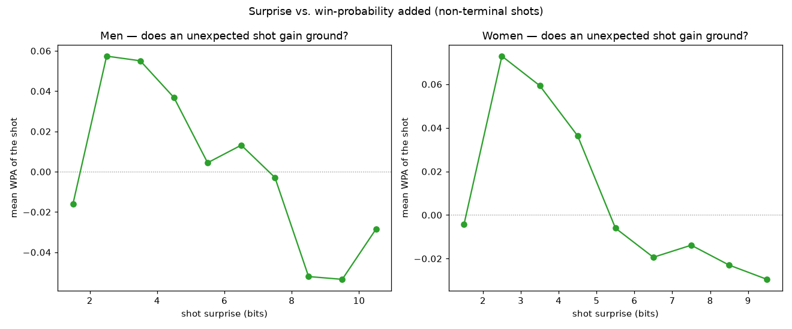
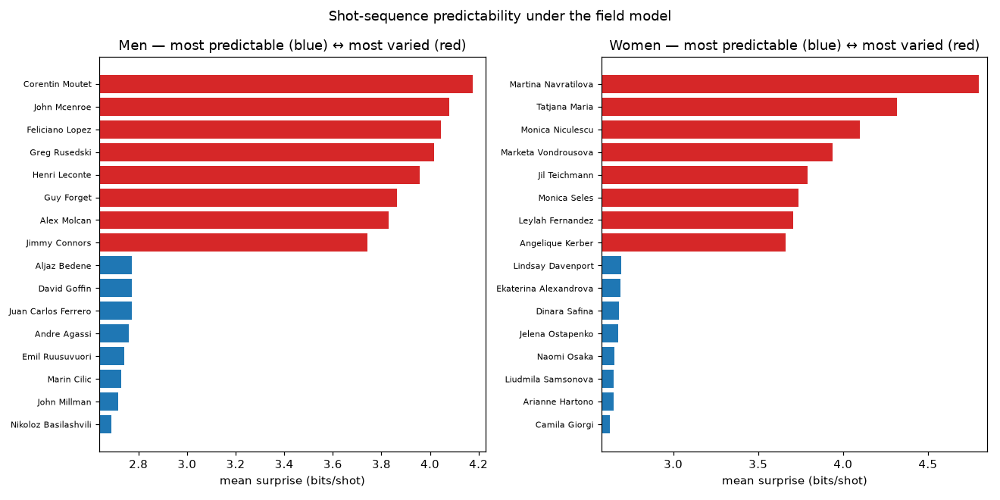

# Shot-sequence language model

*Generated by `experiments/shot_language/run.py`. Each point is a sentence in a small shot alphabet; an order-2 Markov model is the 'opening book'. Surprise = −log₂ P(next shot | last two), in bits — a player's mean surprise is how far their shot choices stray from tour norms.*

## Men — 189 players, per-shot perplexity 8.5

**Common phrases** (frequent two-shot context → likeliest next shot):
- `BH drive→3 · BH drive→3` → **BH drive→3**
- `FH drive→1 · FH drive→1` → **FH drive→3**
- `FH drive→3 · BH drive→3` → **BH drive→3**
- `BH drive→2 · FH drive→1` → **FH drive→1**
- `FH drive→1 · FH drive→3` → **<end>**

**Predictability leaderboard** (mean bits/shot):

| most varied | bits | | most predictable | bits |
|---|---|---|---|---|
| Corentin Moutet | 3.83 | | Nikoloz Basilashvili | 2.75 |
| Greg Rusedski | 3.80 | | Marin Cilic | 2.76 |
| Fabrice Santoro | 3.78 | | Thomas Enqvist | 2.76 |
| Patrick Rafter | 3.71 | | Juan Carlos Ferrero | 2.81 |
| John Mcenroe | 3.69 | | Emil Ruusuvuori | 2.81 |
| Feliciano Lopez | 3.63 | | John Millman | 2.81 |

**Signature patterns** of the most varied players (lift vs. field):
- **Corentin Moutet**: FH drive→1 → **BH slice→2** (9.0×); FH drive→3 → **FH drive→1** (5.9×); FH drive→1 → **BH drive→2** (4.4×); BH drive→3 → **FH drive→1** (4.4×)
- **Greg Rusedski**: serve wide → **BH slice→2** (5.6×); <s> → **serve wide** (1.1×); <s> → **serve T** (1.0×); <s> → **serve body** (0.9×)
- **Fabrice Santoro**: FH drive→1 → **FH slice→3** (18.6×); FH drive→3 → **BH drive→3** (2.1×); BH drive→3 → **BH drive→3** (2.0×); <s> → **serve body** (1.2×)

## Women — 120 players, per-shot perplexity 7.9

**Common phrases** (frequent two-shot context → likeliest next shot):
- `FH drive→1 · FH drive→1` → **FH drive→1**
- `BH drive→3 · BH drive→3` → **BH drive→3**
- `BH drive→2 · FH drive→1` → **FH drive→1**
- `FH drive→1 · FH drive→3` → **<end>**
- `FH drive→3 · BH drive→3` → **BH drive→3**

**Predictability leaderboard** (mean bits/shot):

| most varied | bits | | most predictable | bits |
|---|---|---|---|---|
| Martina Navratilova | 4.23 | | Liudmila Samsonova | 2.67 |
| Tatjana Maria | 4.18 | | Naomi Osaka | 2.68 |
| Monica Niculescu | 4.10 | | Ekaterina Alexandrova | 2.70 |
| Steffi Graf | 3.59 | | Camila Giorgi | 2.72 |
| Marketa Vondrousova | 3.50 | | Magda Linette | 2.72 |
| Sara Sorribes Tormo | 3.40 | | Jelena Ostapenko | 2.73 |

**Signature patterns** of the most varied players (lift vs. field):
- **Martina Navratilova**: FH drive→1 → **BH slice→3** (29.7×); FH drive→1 → **BH slice→2** (21.3×); serve wide → **BH slice→2** (10.2×); FH drive→3 → **FH drive→1** (9.6×)
- **Tatjana Maria**: FH drive→1 → **FH slice→2** (12.1×); FH drive→3 → **BH slice→3** (9.6×); BH drive→3 → **BH slice→3** (8.3×); FH drive→3 → **BH slice→2** (5.3×)
- **Monica Niculescu**: FH drive→1 → **FH slice→1** (21.5×); FH drive→1 → **FH slice→3** (17.7×); FH drive→1 → **FH slice→2** (7.3×); FH drive→3 → **BH drive→2** (2.4×)

## Does an unexpected shot pay off? (surprise is a style, not an edge)

- **Men**: surprise↔WPA correlation = +0.039 (negligible). Mean WPA peaks at moderate surprise (~+0.057) and falls to -0.029 for the most unexpected shots.
- **Women**: surprise↔WPA correlation = -0.027 (negligible). Mean WPA peaks at moderate surprise (~+0.071) and falls to -0.003 for the most unexpected shots.

So there is **no payoff to surprise**: the relationship is non-monotone and ~0 overall. Sound, moderately-aggressive shots gain the most; the *most* unexpected shots slightly lose ground — they are typically defensive, forced gets, not creative winners (game-state drives the tail, not creativity). Unpredictability differentiates *who a player is*, not *how well they're playing*.

**Caveats.** Surprise is measured against tour norms, so it rewards rare shot *types* (slice, net, drop) as much as rare *sequencing*; the surprise↔WPA link is correlational and shares the point eval's selection/execution/pressure conflation. Same charting-coverage caveat as the rest of the repo.
