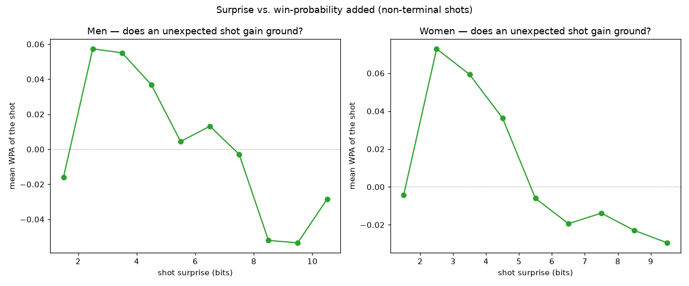
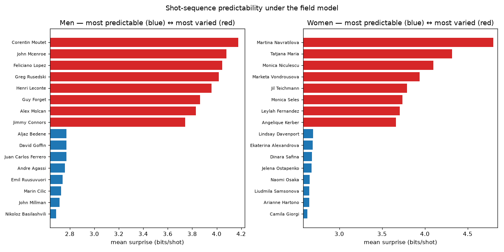

# Shot-sequence language model

*Generated by `experiments/shot_language/run.py`. Each point is a sentence in a small shot alphabet; an order-2 Markov model is the 'opening book'. Surprise = −log₂ P(next shot | last two), in bits; a player's mean surprise is how far their shot choices stray from tour norms.*

## Men — 526 players, per-shot perplexity 8.5

**Common phrases** (frequent two-shot context → likeliest next shot):
- `BH drive→3 · BH drive→3` → **BH drive→3**
- `FH drive→1 · FH drive→1` → **FH drive→3**
- `FH drive→3 · BH drive→3` → **BH drive→3**
- `BH drive→2 · FH drive→1` → **FH drive→1**
- `FH drive→1 · FH drive→3` → **<end>**

**Predictability leaderboard** (mean bits/shot):

| most varied | bits | | most predictable | bits |
|---|---|---|---|---|
| Michael Llodra | 4.15 | | Dominik Hrbaty | 2.73 |
| Taylor Dent | 4.05 | | Nikoloz Basilashvili | 2.74 |
| Ken Rosewall | 4.03 | | Andrey Kuznetsov | 2.76 |
| Ilie Nastase | 4.03 | | Vincent Spadea | 2.77 |
| Rod Laver | 3.98 | | Salvatore Caruso | 2.77 |
| John Newcombe | 3.97 | | Lukas Lacko | 2.77 |

**Signature patterns** of the most varied players (lift vs. field):
- **Michael Llodra**: FH drive→1 → **BH slice→3** (22.9×); FH drive→1 → **BH slice→1** (16.9×); FH drive→3 → **FH drive→1** (4.8×); serve T → **BH slice→2** (3.5×)
- **Taylor Dent**: serve T → **FH slice→2** (10.1×); FH drive→3 → **BH slice→3** (6.7×); serve wide → **BH slice→3** (6.1×); serve T → **BH slice→2** (3.9×)
- **Ken Rosewall**: serve wide → **BH slice→3** (5.5×); serve T → **BH slice→2** (4.1×); <s> → **serve wide** (1.1×); <s> → **serve T** (1.0×)

## Women — 378 players, per-shot perplexity 8.0

**Common phrases** (frequent two-shot context → likeliest next shot):
- `FH drive→1 · FH drive→1` → **FH drive→1**
- `BH drive→3 · BH drive→3` → **BH drive→3**
- `BH drive→2 · FH drive→1` → **FH drive→1**
- `FH drive→1 · FH drive→3` → **<end>**
- `FH drive→3 · BH drive→3` → **BH drive→3**

**Predictability leaderboard** (mean bits/shot):

| most varied | bits | | most predictable | bits |
|---|---|---|---|---|
| Amina Anshba | 4.56 | | Alisa Kleybanova | 2.61 |
| Martina Navratilova | 4.36 | | Arianne Hartono | 2.63 |
| Tatjana Maria | 4.34 | | Yue Yuan | 2.66 |
| Monica Niculescu | 4.21 | | Daria Snigur | 2.68 |
| Helena Sukova | 4.19 | | Katie Swan | 2.68 |
| Zina Garrison | 4.19 | | Liudmila Samsonova | 2.69 |

**Signature patterns** of the most varied players (lift vs. field):
- **Amina Anshba**: BH drive→3 → **FH lob→1** (591.8×); FH drive→3 → **FH lob→1** (232.3×); FH drive→3 → **FH lob→2** (54.7×); FH drive→1 → **BH lob→2** (51.5×)
- **Martina Navratilova**: FH drive→3 → **FH net→2** (102.8×); BH drive→1 → **BH net→2** (91.2×); BH drive→1 → **BH net→1** (87.5×); FH drive→3 → **FH net→3** (71.8×)
- **Tatjana Maria**: FH drive→2 → **FH slice→1** (41.7×); FH drive→2 → **FH slice→3** (31.2×); serve body → **BH slice→3** (30.1×); FH drive→2 → **FH slice→2** (29.9×)

## Does an unexpected shot pay off? (surprise is a style, not an edge)

- **Men**: surprise↔WPA correlation = +0.033 (negligible). Mean WPA peaks at moderate surprise (~+0.057) and falls to -0.027 for the most unexpected shots.
- **Women**: surprise↔WPA correlation = -0.034 (negligible). Mean WPA peaks at moderate surprise (~+0.072) and falls to -0.010 for the most unexpected shots.

So there is **no payoff to surprise**: the relationship is non-monotone and ~0 overall. Sound, moderately-aggressive shots gain the most; the *most* unexpected shots slightly lose ground, since they are typically defensive scrambles, not creative winners (game-state drives the tail, not creativity). Unpredictability differentiates *who a player is*, not *how well they're playing*.

**Caveats.** Surprise is measured against tour norms, so it rewards rare shot *types* (slice, net, drop) as much as rare *sequencing*; the surprise↔WPA link is correlational and shares the point eval's selection/execution/pressure conflation. Same charting-coverage caveat as the rest of the repo.
