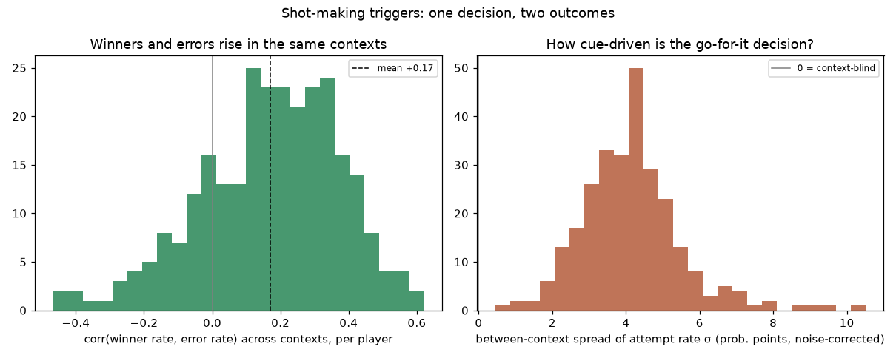

# Shot-making triggers — aggressive shot frequency, conversion, traps, immunity

*Generated by `experiments/shot_triggers/run.py`. An **aggressive shot** = the player's stroke ended the point on their own racquet (winner, own unforced error) or forced the reply into an error; **aggressive shot frequency** = how often a rally stroke is one; **conversion** = the share that paid, meaning a winner or an induced forced error. Per player, contexts (two prior shots) are tagged **green light** (frequency up, conversion holds) or **trap** (frequency up, conversion below their norm). σ measures how context-driven the decision is (0 = context-blind), with binomial sampling noise subtracted. The numerator is justified against the narrower finishing-shot reading in its own section below.*

## Men

### Roger Federer
*aggressive on 26.5% of strokes, converting 61%; across their trigger cues, 82%; 154,778 contextful strokes*

**Trigger sequences** (lead-ups that most raise the frequency):
- `FH drive→3 · BH shot→1` → aggressive 82% (3.1×), converts 93% (+11% vs their other cues) ✅ converts (n=126, 103 attempts)
- `FH drive→3 · BH shot→2` → aggressive 81% (3.1×), converts 93% (+11% vs their other cues) ✅ converts (n=383, 311 attempts)
- `FH net→3 · BH shot→2` → aggressive 78% (2.9×), converts 94% (+12% vs their other cues) ✅ converts (n=127, 99 attempts)
- `BH net→3 · BH shot→2` → aggressive 77% (2.9×), converts 98% (+16% vs their other cues) ✅ converts (n=78, 60 attempts)

**Worst traps** (pulled into aggressive shots they don't convert):
- `FH drive→1 · BH slice→1` → aggressive 1.4× their norm but converts only 47% vs 82% across their other cues (n=40, 15 attempts)
- `FH drive→2 · BH net→1` → aggressive 1.5× their norm but converts only 55% vs 82% across their other cues (n=27, 11 attempts)
- `BH drive→2 · FH net→3` → aggressive 1.3× their norm but converts only 62% vs 82% across their other cues (n=61, 21 attempts)

### Novak Djokovic
*aggressive on 19.4% of strokes, converting 61%; across their trigger cues, 78%; 153,390 contextful strokes*

**Trigger sequences** (lead-ups that most raise the frequency):
- `FH drive→3 · BH shot→1` → aggressive 84% (4.3×), converts 90% (+11% vs their other cues) ✅ converts (n=80, 67 attempts)
- `FH drive→3 · BH shot→2` → aggressive 69% (3.5×), converts 92% (+14% vs their other cues) ✅ converts (n=286, 196 attempts)
- `FH drive→1 · FH shot→2` → aggressive 60% (3.1×), converts 85% (+7% vs their other cues) ✅ converts (n=133, 80 attempts)
- `FH net→3 · BH drive→2` → aggressive 60% (3.1×), converts 85% (+7% vs their other cues) ✅ converts (n=67, 40 attempts)

**Worst traps** (pulled into aggressive shots they don't convert):
- `FH drive→3 · FH slice→3` → aggressive 1.7× their norm but converts only 58% vs 78% across their other cues (n=37, 12 attempts)
- `FH drive→1 · BH slice→3` → aggressive 1.4× their norm but converts only 61% vs 78% across their other cues (n=158, 44 attempts)
- `serve wide · BH drive→3` → aggressive 1.5× their norm but converts only 63% vs 78% across their other cues (n=2365, 708 attempts)

### Rafael Nadal
*aggressive on 18.8% of strokes, converting 65%; across their trigger cues, 83%; 114,596 contextful strokes*

**Trigger sequences** (lead-ups that most raise the frequency):
- `FH drive→1 · BH shot→2` → aggressive 71% (3.8×), converts 96% (+13% vs their other cues) ✅ converts (n=214, 151 attempts)
- `FH drive→1 · BH shot→3` → aggressive 70% (3.8×), converts 90% (+7% vs their other cues) ✅ converts (n=115, 81 attempts)
- `FH drive→3 · FH shot→2` → aggressive 70% (3.7×), converts 93% (+10% vs their other cues) ✅ converts (n=145, 101 attempts)
- `FH drive→3 · FH slice→1` → aggressive 68% (3.6×), converts 92% (+9% vs their other cues) ✅ converts (n=71, 48 attempts)

**Worst traps** (pulled into aggressive shots they don't convert):
- `BH drive→2 · BH slice→3` → aggressive 1.5× their norm but converts only 60% vs 83% across their other cues (n=34, 10 attempts)
- `BH drive→1 · BH slice→1` → aggressive 1.8× their norm but converts only 65% vs 83% across their other cues (n=273, 91 attempts)
- `BH slice→1 · BH slice→3` → aggressive 1.4× their norm but converts only 68% vs 83% across their other cues (n=82, 22 attempts)

### Pete Sampras
*aggressive on 32.8% of strokes, converting 65%; across their trigger cues, 80%; 33,391 contextful strokes*

**Trigger sequences** (lead-ups that most raise the frequency):
- `FH net→3 · BH shot→2` → aggressive 83% (2.5×), converts 94% (+14% vs their other cues) ✅ converts (n=64, 53 attempts)
- `BH net→3 · BH drive→1` → aggressive 74% (2.3×), converts 85% (+5% vs their other cues) ✅ converts (n=74, 55 attempts)
- `FH drive→3 · BH shot→2` → aggressive 69% (2.1×), converts 96% (+16% vs their other cues) ✅ converts (n=70, 48 attempts)
- `BH net→1 · FH drive→3` → aggressive 68% (2.1×), converts 92% (+11% vs their other cues) ✅ converts (n=111, 75 attempts)

**Worst traps** (pulled into aggressive shots they don't convert):
- `BH slice→2 · BH slice→3` → aggressive 1.4× their norm but converts only 40% vs 80% across their other cues (n=33, 15 attempts)
- `BH drive→2 · BH net→2` → aggressive 1.8× their norm but converts only 62% vs 80% across their other cues (n=67, 40 attempts)
- `serve T · BH slice→3` → aggressive 1.1× their norm but converts only 68% vs 80% across their other cues (n=105, 40 attempts)

### Andre Agassi
*aggressive on 22.7% of strokes, converting 63%; across their trigger cues, 77%; 50,089 contextful strokes*

**Trigger sequences** (lead-ups that most raise the frequency):
- `FH drive→3 · BH shot→2` → aggressive 81% (3.6×), converts 88% (+10% vs their other cues) ✅ converts (n=140, 113 attempts)
- `BH drive→3 · BH shot→2` → aggressive 74% (3.2×), converts 89% (+11% vs their other cues) ✅ converts (n=72, 53 attempts)
- `FH drive→1 · FH shot→2` → aggressive 68% (3.0×), converts 92% (+15% vs their other cues) ✅ converts (n=74, 50 attempts)
- `FH drive→2 · FH net→2` → aggressive 65% (2.9×), converts 67% (-11% vs their other cues) ⚠️ trap (n=60, 39 attempts)

**Worst traps** (pulled into aggressive shots they don't convert):
- `BH slice→3 · BH slice→3` → aggressive 1.2× their norm but converts only 47% vs 77% across their other cues (n=67, 19 attempts)
- `FH drive→1 · FH slice→3` → aggressive 1.1× their norm but converts only 67% vs 77% across their other cues (n=23, 6 attempts)
- `FH drive→3 · BH slice→2` → aggressive 1.6× their norm but converts only 66% vs 77% across their other cues (n=594, 214 attempts)

## Women

### Serena Williams
*aggressive on 27.5% of strokes, converting 55%; across their trigger cues, 70%; 19,943 contextful strokes*

**Trigger sequences** (lead-ups that most raise the frequency):
- `serve wide · BH slice→2` → aggressive 54% (2.0×), converts 77% (+9% vs their other cues) ✅ converts (n=106, 57 attempts)
- `serve wide · FH slice→2` → aggressive 48% (1.7×), converts 61% (-9% vs their other cues) ⚠️ trap (n=96, 46 attempts)
- `BH drive→3 · BH slice→2` → aggressive 40% (1.5×), converts 66% (-10% vs their other cues) ⚠️ trap (n=131, 53 attempts)
- `FH drive→1 · FH slice→2` → aggressive 39% (1.4×), converts 68% (-8% vs their other cues) ⚠️ trap (n=57, 22 attempts)

**Worst traps** (pulled into aggressive shots they don't convert):
- `BH drive→3 · BH slice→2` → aggressive 1.5× their norm but converts only 66% vs 70% across their other cues (n=131, 53 attempts)
- `serve wide · FH slice→2` → aggressive 1.7× their norm but converts only 61% vs 70% across their other cues (n=96, 46 attempts)
- `FH drive→1 · FH slice→2` → aggressive 1.4× their norm but converts only 68% vs 70% across their other cues (n=57, 22 attempts)

### Iga Swiatek
*aggressive on 27.4% of strokes, converting 58%; across their trigger cues, 76%; 33,739 contextful strokes*

**Trigger sequences** (lead-ups that most raise the frequency):
- `BH drive→3 · BH shot→2` → aggressive 73% (2.7×), converts 83% (+7% vs their other cues) ✅ converts (n=74, 54 attempts)
- `FH drive→3 · BH shot→2` → aggressive 72% (2.6×), converts 86% (+10% vs their other cues) ✅ converts (n=145, 104 attempts)
- `serve wide · FH slice→1` → aggressive 57% (2.1×), converts 69% (-7% vs their other cues) ⚠️ trap (n=84, 48 attempts)
- `FH drive→1 · FH slice→2` → aggressive 53% (1.9×), converts 77% (+1% vs their other cues) ✅ converts (n=258, 136 attempts)

**Worst traps** (pulled into aggressive shots they don't convert):
- `serve body · FH slice→2` → aggressive 1.6× their norm but converts only 40% vs 76% across their other cues (n=23, 10 attempts)
- `FH drive→1 · FH slice→1` → aggressive 1.8× their norm but converts only 63% vs 76% across their other cues (n=118, 57 attempts)
- `FH drive→3 · BH slice→3` → aggressive 1.6× their norm but converts only 66% vs 76% across their other cues (n=166, 73 attempts)

### Martina Navratilova
*aggressive on 24.8% of strokes, converting 67%; across their trigger cues, 85%; 4,247 contextful strokes*

**Trigger sequences** (lead-ups that most raise the frequency):

**No trap contexts** — no cue that raises the frequency was found to convert below the rest of their cues when tested on matches that had no part in selecting it. Unbaitable (at this resolution).

### Steffi Graf
*aggressive on 21.4% of strokes, converting 57%; across their trigger cues, 71%; 18,226 contextful strokes*

**Trigger sequences** (lead-ups that most raise the frequency):
- `FH drive→3 · BH slice→2` → aggressive 38% (1.8×), converts 80% (+8% vs their other cues) ✅ converts (n=242, 93 attempts)
- `FH drive→3 · FH drive→2` → aggressive 35% (1.6×), converts 79% (+6% vs their other cues) ✅ converts (n=55, 19 attempts)
- `serve wide · BH slice→2` → aggressive 30% (1.5×), converts 61% (-7% vs their other cues) ⚠️ trap (n=119, 36 attempts)
- `serve T · BH slice→2` → aggressive 30% (1.4×), converts 60% (-8% vs their other cues) ⚠️ trap (n=100, 30 attempts)

**Worst traps** (pulled into aggressive shots they don't convert):
- `BH slice→3 · BH slice→1` → aggressive 1.2× their norm but converts only 50% vs 71% across their other cues (n=121, 32 attempts)
- `serve T · BH slice→2` → aggressive 1.4× their norm but converts only 60% vs 71% across their other cues (n=100, 30 attempts)
- `serve wide · BH slice→2` → aggressive 1.5× their norm but converts only 61% vs 71% across their other cues (n=119, 36 attempts)

## Are the winner book and the error book the same book?

Across 274 qualifying players, the correlation between a context's winner rate and its unforced-error rate is **+0.17 on average** (80% of players positive). And that *understates* the overlap: a stroke can't be both a winner and an error, so pure chance pushes this correlation negative. Sequences that precede winners also precede errors because both mark the same decision — going for the finish. `shot_patterns`' green/trouble split partly conflates decision with execution; frequency + conversion separates them.

## Why the numerator counts induced forced errors

Through 2026-08-05 this experiment counted only shots that ended the point on the player's own racquet — a winner or their own unforced error. Call that the **finishing shot frequency**. The wider and standard reading also credits a shot that forced the reply into an error, which is the **aggressive shot frequency** shipped above. The worry about widening it is that the forced/unforced call is the most charter-subjective field in the notation, so the extra events might be mostly noise. They are not.

Each player's matches are split at random into halves and every well-supported context (≥25 strokes in *both* halves) is measured twice. The correlation between the two measurements is the share of the apparent between-context spread that replicates. Because the split is by match, charters disagreeing with each other lands inside the noise term this is testing.

| | finishing (w+ue) | aggressive (+induced FE) |
|---|--:|--:|
| split-half r, all 12,539 contexts | +0.762 | **+0.811** |
| per-player median r (273 players) | +0.608 | **+0.699** |
| players it is more reliable for | 16% | **84%** |
| mean base frequency | 18.0% | 22.9% |
| mean conversion | 43.8% | 55.8% |

The wider numerator wins, and it wins against a handicap: a base rate moving from 18.0% to 22.9% raises the binomial noise floor by about a fifth, so a numerator made of noise would have *lost* this test. The extra events carry structure.

Two things follow. First, the player ranking barely moves — the two frequencies correlate +0.991 across players — so this is not a rewrite of who is aggressive. Second, the *composition* moves a lot, and not at random: induced forced errors are 21% of the numerator on average but range from 14% to 34%. The narrow definition systematically under-credited players whose aggression works by pressure rather than by clean winners.

| most under-credited by the old numerator | induced FE share | least |  induced FE share |
|---|--:|---|--:|
| Fabrice Santoro (M) | 34% | Reilly Opelka (M) | 14% |
| Monica Niculescu (W) | 31% | Benoit Paire (M) | 14% |
| Caroline Wozniacki (W) | 29% | Madison Keys (W) | 16% |
| Mats Wilander (M) | 28% | Daniel Altmaier (M) | 16% |
| Novak Djokovic (M) | 28% | Anett Kontaveit (W) | 16% |

The cue lists move more than the leaderboard does. Of the 1,425 contexts either definition flags, they agree on 50%; the old numerator flagged 983 and this one flags 1,203. Traps fall from 436 to 546, which is the substantive correction: a shot that forced an error used to count as neither a success nor an aggressive shot, so a cue that reliably produced them read as low-conversion and got labelled a trap it had not earned.

**What this test does not cover.** Split-half catches charters disagreeing with each other, not a bias they share. If the tour's charters collectively over-call *forced* for one kind of player, both definitions inherit it and this comparison would not show it.

## Pattern-immunity leaderboard (σ)

σ = the true between-context spread of a player's aggressive shot frequency, in probability points, after subtracting binomial sampling noise (so charting volume doesn't distort the comparison). 0 would mean the decision ignores the lead-up entirely.

| most cue-driven | σ (pp) | most pattern-immune | σ (pp) |
|---|---|---|---|
| Patrick Rafter (M) | 13.8 | John Millman (M) | 0.7 |
| Stefan Edberg (M) | 12.7 | Andrei Chesnokov (M) | 0.9 |
| John Isner (M) | 11.9 | Chris Evert (W) | 1.9 |
| John Mcenroe (M) | 11.2 | Sara Sorribes Tormo (W) | 2.1 |
| Michael Stich (M) | 11.2 | Mikael Ymer (M) | 2.1 |

## Opening sequences by serve side (deuce vs ad)

The pooled tables above average over the court the point was served to, but the first four plies mean different things on the two sides: a wide serve opens the forehand in the deuce court and the backhand in the ad court. Here the opening aggressive shots — the return, the serve+1, and the return+1 — are split by side and scored against the player's own norm *for that same shot and side*. Everything deeper in the rally stays pooled (above). Full rows in `reports/shot_triggers_openings.csv`; 125 green / 92 trap sequences across 104 players.

**These are cross-validated as of 2026-08-29, and were not before.** Until then this section was a raw threshold screen — clear the support floor, clear the lift, tag on the sign of the conversion gap — with no multiplicity correction and every figure computed on the data that had just selected the row. The pooled tables above had been FDR-corrected and cross-validated since `tag_contexts` landed, so this experiment was shipping one screened table and one unscreened one. Now each (player, side, anchor) group splits into the same two match-hash folds: one discovers, with an exact binomial tail against that fold's own group baseline and Benjamini-Hochberg at q=0.1 across every context it could test; the other confirms and supplies every number shown.

That took the table from 484 rows over 171 players to 217 over 104. 118 rows cleared from both directions and show the two folds pooled; the 99 that cleared from one show that fold alone, and across those the mean lift falls from 1.69x where it was found to **1.31x where it was measured — 45% of the discovered edge**. `court_response` measured 46% on the same kind of test and `rally_patterns` 50%, over different features and different screens, which is three independent readings of the same number.

### Men

### Roger Federer

**Serve, deuce court**
- ✅ `serve wide · BH slice→2` → serve+1 aggressive 57% (1.7×), converts 86% (+4% vs norm) (n=174)
- ✅ `serve T · BH slice→2` → serve+1 aggressive 54% (1.6×), converts 82% (+1% vs norm) (n=1392)
- ⚠️ `serve wide · FH slice→1` → serve+1 aggressive 44% (1.3×) but converts only 70% (-15% vs norm) (n=75)
- ⚠️ `serve T · BH slice→1` → serve+1 aggressive 59% (1.8×) but converts only 77% (-5% vs norm) (n=213)

**Serve, ad court**
- ✅ `serve wide · BH slice→2` → serve+1 aggressive 62% (1.9×), converts 84% (+1% vs norm) (n=781)

**Return, deuce court**
- ✅ `BH drive→2 · BH net→3` → return+1 aggressive 46% (2.2×), converts 81% (+14% vs norm) (n=81)
- ⚠️ `BH drive→1 · FH drive→2` → return+1 aggressive 26% (1.2×) but converts only 58% (-14% vs norm) (n=73)

**Return, ad court**
- ⚠️ `FH drive→2 · BH drive→2` → return+1 aggressive 30% (1.4×) but converts only 40% (-30% vs norm) (n=115)
- ⚠️ `FH drive→3 · BH drive→2` → return+1 aggressive 34% (1.6×) but converts only 57% (-8% vs norm) (n=316)

### Novak Djokovic

**Serve, deuce court**
- ✅ `serve wide · FH slice→2` → serve+1 aggressive 44% (1.8×), converts 85% (+4% vs norm) (n=433)
- ✅ `serve wide · FH slice→3` → serve+1 aggressive 34% (1.4×), converts 90% (+8% vs norm) (n=62)
- ⚠️ `serve wide · BH slice→2` → serve+1 aggressive 44% (1.8×) but converts only 78% (-3% vs norm) (n=236)
- ⚠️ `serve T · BH slice→2` → serve+1 aggressive 38% (1.6×) but converts only 79% (-2% vs norm) (n=1050)

**Serve, ad court**
- ⚠️ `serve body · BH slice→2` → serve+1 aggressive 31% (1.2×) but converts only 72% (-14% vs norm) (n=80)
- ⚠️ `serve T · BH slice→2` → serve+1 aggressive 39% (1.6×) but converts only 82% (-3% vs norm) (n=204)

**Return, deuce court**
- ✅ `BH drive→1 · FH drive→2` → return+1 aggressive 19% (1.4×), converts 68% (+6% vs norm) (n=130)

**Return, ad court**
- ⚠️ `FH drive→2 · FH drive→2` → return+1 aggressive 16% (1.1×) but converts only 54% (-21% vs norm) (n=261)

### Rafael Nadal

**Serve, deuce court**
- ✅ `serve wide · FH slice→2` → serve+1 aggressive 47% (2.6×), converts 81% (+2% vs norm) (n=77)
- ✅ `serve T · BH slice→3` → serve+1 aggressive 36% (2.0×), converts 88% (+9% vs norm) (n=200)
- ⚠️ `serve wide · FH slice→3` → serve+1 aggressive 44% (2.5×) but converts only 68% (-11% vs norm) (n=90)
- ⚠️ `serve wide · BH drive→2` → serve+1 aggressive 26% (1.4×) but converts only 74% (-4% vs norm) (n=90)

**Serve, ad court**
- ✅ `serve wide · BH slice→2` → serve+1 aggressive 45% (1.9×), converts 88% (+2% vs norm) (n=568)
- ✅ `serve wide · BH slice→3` → serve+1 aggressive 44% (1.8×), converts 93% (+7% vs norm) (n=168)
- ⚠️ `serve T · FH slice→2` → serve+1 aggressive 35% (1.4×) but converts only 78% (-10% vs norm) (n=66)
- ⚠️ `serve wide · BH slice→1` → serve+1 aggressive 45% (1.9×) but converts only 80% (-6% vs norm) (n=283)

**Return, ad court**
- ⚠️ `FH drive→1 · FH drive→2` → return+1 aggressive 20% (1.2×) but converts only 48% (-19% vs norm) (n=118)
- ⚠️ `FH drive→1 · BH drive→2` → return+1 aggressive 21% (1.3×) but converts only 62% (-6% vs norm) (n=280)

### Pete Sampras

**Serve, ad court**
- ⚠️ `serve wide · BH slice→2` → serve+1 aggressive 59% (1.4×) but converts only 74% (-4% vs norm) (n=93)

### Andre Agassi

**Return, ad court**
- ⚠️ `FH drive→2 · FH net→3` → return+1 aggressive 40% (1.8×) but converts only 66% (-17% vs norm) (n=72)

### Women

### Serena Williams

**Return, ad court**
- ⚠️ `FH drive→3 · BH drive→2` → return+1 aggressive 31% (1.3×) but converts only 65% (-9% vs norm) (n=64)

### Iga Swiatek

**Serve, deuce court**
- ⚠️ `serve wide · FH slice→1` → serve+1 aggressive 57% (2.2×) but converts only 69% (-6% vs norm) (n=84)
- ⚠️ `serve wide · BH drive→2` → serve+1 aggressive 27% (1.1×) but converts only 71% (-4% vs norm) (n=62)

