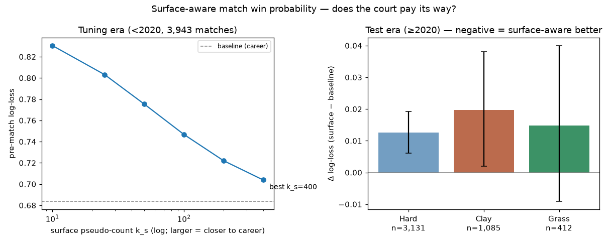

# Surface-aware match win probability

*Generated by `experiments/surface_winprob/run.py`. One knob: serve/return rates backed off surface → career → tour with pseudo-count `k_s`, tuned pre-2020, judged once on 2020+. Same score tree, same walk-forward discipline in both arms; matches count only when both players have ≥3 prior charted matches.*

Tour anchors: mu = 0.642 (men), 0.570 (women). Least-bad `k_s` on the tuning era: **400** (train log-loss 0.7039 vs baseline 0.6836). Note the tuning curve never dips below the baseline line — the tuned optimum is effectively `k_s → ∞`, i.e. the baseline itself; the test numbers below score the least-bad surface arm for transparency.

## Test-era result

| | matches | log-loss base | log-loss surface | Δ (95% CI) | Brier base | Brier surface |
|---|---|---|---|---|---|---|
| Men | 2,812 | 0.6242 | 0.6314 | +0.0072 (-0.0009, +0.0153) | 0.2163 | 0.2189 |
| Women | 1,816 | 0.6770 | 0.7029 | +0.0259 (+0.0152, +0.0368) | 0.2337 | 0.2401 |

| surface | matches | Δ log-loss (95% CI) |
|---|---|---|
| Hard | 3,131 | +0.0126 (+0.0060, +0.0193) |
| Clay | 1,085 | +0.0197 (+0.0020, +0.0381) |
| Grass | 412 | +0.0149 (-0.0091, +0.0400) |

Even restricted to matchups where **both** players have deep charted history on the match's surface — the only regime a selective version could target — the story holds:

| both players' surface serve pts | matches | Δ log-loss (95% CI) |
|---|---|---|
| ≥500 | 2,715 | +0.0043 (-0.0032, +0.0122) |
| ≥1,500 | 1,175 | +0.0060 (-0.0022, +0.0149) |

## Face validity — the tilt is real even where the payoff is small

Biggest walk-forward hard-vs-clay serve-rate tilts (men, ≥1,500 serve points on each):

| clay-tilted | Δ | hard-tilted | Δ |
|---|---|---|---|
| Borna Coric | -0.022 | Boris Becker | +0.078 |
| Marin Cilic | -0.019 | Marat Safin | +0.063 |
| David Goffin | -0.016 | Daniil Medvedev | +0.051 |

## Verdict

**Does not pay as designed.** The held-out era shows no consistent improvement: relative surface tilts are mostly too small or too thinly sampled in charted data to move matchup predictions. Keep the surface-blind model; revisit only with fuller (non-charted) results data per surface.
